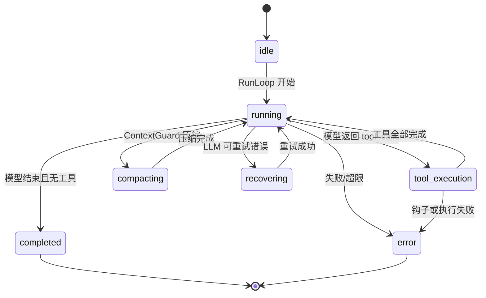
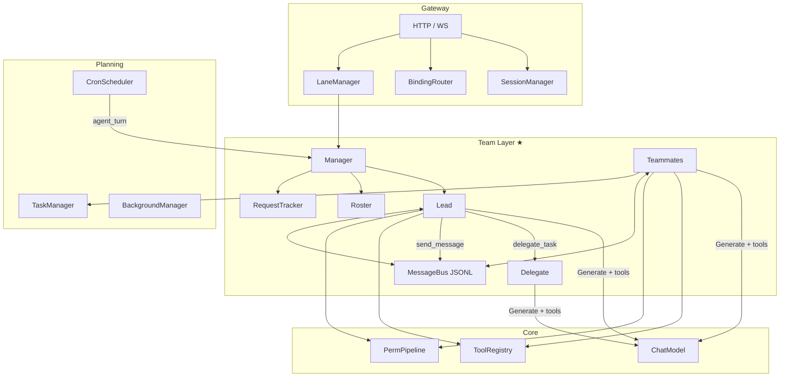
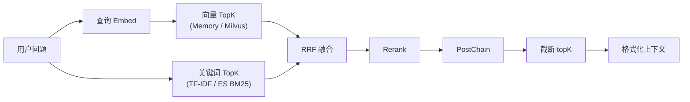

# Nexus 系统架构说明

本文档面向**中文技术面试与架构答辩**：系统梳理 [Nexus](https://github.com/rainea/nexus)（Go 实现的多智能体网关与 Agent 运行时）的分层设计、核心循环、编排协议、RAG、工具与 MCP、记忆与规划、网关与权限、提示词组装及可观测性，并集中回答「为何如此设计」。

**阅读建议**：先通读「架构总览」与「关键设计决策」，再按需深入各子系统。文中路径均以仓库根目录 `nexus/` 为基准。

---

## 1. 架构总览

### 1.1 五层逻辑架构（ASCII）

Nexus 在进程内采用**自顶向下、职责清晰**的五层模型：最外层处理多通道接入与隔离，向内是**团队协作调度层**（取代传统 Supervisor 编排），再往内是单 Agent 引擎、知识与工具能力，最底层承载持久化记忆、任务 DAG、权限与度量等横切能力。

```
┌─────────────────────────────────────────────────────────────────────────────┐
│  L1 接入与隔离层 (Gateway)                                                   │
│  HTTP / WebSocket 会话、BindingRouter 五档绑定、Named Lane 队列与代际淘汰      │
│  Middleware：trace（可扩展 auth / ratelimit）                                 │
├─────────────────────────────────────────────────────────────────────────────┤
│  L2 团队协作调度层 (Team)                                        ★ 核心亮点  │
│  Manager → Lead(嵌入Teammate) → 持久Teammate / 临时Delegate                  │
│  JSONL Inbox Bus · RequestTracker(shutdown/plan) · Roster(config.json)      │
│  三级 Dispatch：直接处理 / delegate_task / send_message+spawn_teammate       │
│  自治引擎：work→idle 状态机 · 收件箱>任务认领>超时关闭 · 进程重启 rehydrate  │
├─────────────────────────────────────────────────────────────────────────────┤
│  L3 Agent 核心引擎层 (Core + Reflection)                                     │
│  ReAct 循环、LoopState 状态机、ContextGuard 压缩、RecoveryManager 三层恢复    │
│  三阶反思引擎：前瞻批判 + 评估 + 三级回顾（micro/meso/macro）                  │
│  工具解析：本地 ToolMeta + ToolRegistry 按名 map 派发                         │
├─────────────────────────────────────────────────────────────────────────────┤
│  L4 知识与工具能力层 (RAG / Tool / MCP)                                      │
│  摄入流水线、多路召回与 RRF 融合、后处理链；内置工具 + MCP JSON-RPC 客户端     │
├─────────────────────────────────────────────────────────────────────────────┤
│  L5 数据与治理层 (Memory / Planning / Permission / Intelligence / Obs)     │
│  会话与语义记忆、任务 DAG 与后台槽位、权限管线、Bootstrap/Skill/Prompt 预算、   │
│  回调与 Span、直方图指标                                                     │
└─────────────────────────────────────────────────────────────────────────────┘
```

### 1.2 各层职责一览

| 层级 | 主要包路径 | 核心职责 |
|------|------------|----------|
| L1 | `internal/gateway/` | 统一入口；把外部 channel/user 映射到会话与（可选）默认 Agent；通过 Lane 控制并发与「清空队列」语义。 |
| L2 | `internal/team/` | **团队协作调度**：Manager 持有 Lead + Teammate map；Lead 嵌入 Teammate 对接网关同步 RPC；持久 Teammate 携带长期对话状态；临时 Delegate 提供上下文隔离的一次性执行；JSONL 邮箱总线、协议请求追踪、名册持久化、自治调度。 |
| L3 | `internal/core/`、`internal/reflection/` | 与模型无关的 ReAct 主循环；消息与阶段状态；上下文压缩与生成重试；工具调用前后钩子。三阶反思引擎（前瞻 + 评估 + 回顾）包裹 Agent.Run，提供语义级自我改进。 |
| L4 | `internal/rag/`、`internal/tool/`、`internal/tool/mcp/` | 离线/在线知识检索；进程内工具注册表；MCP 服务发现与远程工具代理注册。 |
| L5 | `internal/memory/`、`internal/planning/`、`internal/permission/`、`internal/intelligence/`、`internal/observability/` | 长短期记忆与压缩策略；任务图与定时与后台执行槽；工具调用前策略；系统提示拼装与技能懒加载； trace/metrics/callbacks。 |

### 1.3 典型请求路径（简叙）

1. 客户端经 HTTP/WebSocket 发送消息；Gateway 经 `BindingRouter` 与 `LaneManager` 选定车道后，调用 `team.Manager.HandleRequest`。
2. `Manager` 将请求投递到 `Lead.requestCh`，Lead 的 `select` 循环取出请求，进入 `handleOneRequest`。
3. Lead 先 `drainInbox` 获取 Teammate 回复，再将用户输入追加到自身消息历史，进入 model/tool 循环（最大 50 轮迭代）。
4. 模型可自主选择 **三种 dispatch 路径**：
   - **直接处理**：Lead 调用自身 base tools（文件/Shell/搜索等）完成简单任务。
   - **`delegate_task`**：创建**临时 Delegate**，在干净的消息列表上运行角色模板的 system prompt + tools，执行完返回结果、状态即销毁——用于上下文隔离的一次性专家任务。
   - **`send_message` / `spawn_teammate`**：发送消息给**持久 Teammate**（或先 spawn 新 Teammate），Teammate 在独立 goroutine 中处理，结果通过 inbox 异步返回。
5. Teammate 的 `work→idle` 状态机在空闲时按优先级轮询：收件箱消息 > 任务板自动认领（`ScanClaimable` 按角色匹配） > 超时自动关闭。
6. RAG、记忆、规划、权限等通过 `AgentDependencies` 注入，避免 `core` 包反向依赖所有子系统实现细节。

---

## 2. Agent 核心引擎

### 2.1 ReAct 循环

**ReAct**（Reason + Act）在本项目中的落地形态是：**用户消息 → LLM 生成（可选 tool_calls）→ 执行工具 → 将 tool 结果作为消息追加 → 再次调用 LLM**，直到模型在无工具调用的情况下结束回合或达到迭代上限。

实现位置：`internal/core/loop.go` 中 `AgentLoop.RunLoop`。

要点：

- **单次迭代**包括：可选的 `ContextGuard.MaybeCompact`（在阈值附近收缩上下文）、`hooks.PreAPI`、`model.Generate`、`hooks.PostAPI`。
- **是否继续**由 `shouldContinueWithTools` 判断：根据 `FinishReason` 归类为 `tool_use` / `tool_calls` 且存在 `ToolCalls` 时进入工具分支。
- **工具回合**：先将带 `ToolCalls` 的 assistant 消息写入 `LoopState`，再逐条 `executeToolCall`，每条产生一条 `role=tool` 消息，最后 `TransitionTo(PhaseRunning, "tools_done")` 进入下一轮 LLM。
- **正常结束**：无工具调用时追加最终 assistant 消息，`TransitionTo(PhaseCompleted, "model_finished")` 并返回文本。
- **硬上限**：默认最大迭代 20（可由 `AgentConfig.MaxIterations` 覆盖），超出则 `PhaseError` 与 `max_iterations` 错误。

`ChatModel` 接口刻意与 CloudWeGo Eino 解耦（注释说明），便于测试桩与独立编译 `core` 包。

### 2.2 LoopState 状态机

`LoopState`（`internal/core/state.go`）描述**单次 `RunLoop` 调用**内的粗粒度阶段，供可观测性与守卫逻辑使用；**不做持久化**（注释明确：需要 durability 的调用方应外部快照 Messages）。

**阶段枚举** `LoopPhase`：

- `idle`：初始或 `Reset()` 后。
- `running`：主循环进行中（含等待下一次 LLM）。
- `tool_execution`：正在消费本轮 `ToolCalls`。
- `compacting`：`ContextGuard` 触发上下文压缩时转入（见 `internal/core/context.go`）。
- `recovering`：`RecoveryManager` 对 LLM 调用做退避重试时转入。
- `completed`：正常结束。
- `error`：不可恢复或显式失败。

**合法迁移**由 `allowedTransitions` 静态表约束，`TransitionTo` 非法迁移会返回错误。设计意图：

- `compacting` / `recovering` 通常从 `running` 进入，结束后回到 `running`（或失败进 `error`）。
- `tool_execution` 可回到 `running`，也可在异常路径进入 `recovering` / `error`。
- 终态 `completed` / `error` 不再向外转移（除 `Reset` 清空）。

面试可强调：**这是「会话回合级」状态机，不是业务工作流状态机**；后者由 `planning.TaskManager` 的 DAG 承担。

### 2.3 工具派发：map 查找 vs 策略模式

工具解析函数 `resolveTool`（`loop.go`）逻辑：

1. 优先在**当前 Agent 本地** `getTools()` 返回的 `[]*ToolMeta` 中按 `Definition.Name` 匹配。
2. 未命中则回退到 `deps.ToolRegistry.Get(name)`（进程级 `map[string]*ToolMeta`）。

执行时使用 `meta.Handler(ctx, arguments)`，**没有**为每种工具定义单独的 Go 子类型多态分支；扩展方式是**注册新的 `ToolMeta`**（内置在 `tool.RegisterBuiltins`，MCP 在 `RegisterDiscoveredTools` 中动态写入同一 Registry）。

与**策略模式**对比：

- **当前实现**：名字 → 处理器指针的**字典派发**，分支成本 O(1)，适合工具数量中等、动态启停（MCP）场景。
- **策略模式**：每个工具一个实现类型，适合强类型、编译期固定集合且需要复杂组合策略时。Nexus 选择字典以降低插件式扩展的样板代码，并与 LLM 侧「按 name 调用」天然对齐。

### 2.4 三层恢复「洋葱」

`RecoveryManager`（`internal/core/recovery.go`）注释中明确了**三层恢复**，由内到外理解如下。

**第一层（工具错误 → 模型可见）**  
工具执行失败时不静默吞掉：通过 `WrapToolError` 构造 `ToolResult{IsError: true}`，错误文本进入对话历史，让模型在下一轮**自纠**或改参数重试。`executeToolCall` 在 handler 返回 error 时仍返回包装后的结果。

**第二层（上下文 / Token 溢出 → 压缩）**  
`IsContextOverflowError` 对常见 provider 错误串做启发式匹配；`AgentLoop` 在 `Generate` 失败时若判定为上下文溢出，可触发 `ContextGuard.ForceManualCompact`。与正常迭代里的 `MaybeCompact` 一起构成**预算守卫**，对应状态机上的 `PhaseCompacting`。

**第三层（传输层抖动 → 退避重试）**  
`CallWithRetry` 包装对 LLM 的调用：`isRetryable` 识别超时、连接重置、429、502/503/504 等；指数退避 + 抖动 + 可选总预算 `MaxRetryBudget`；重试等待期间可将 `LoopState` 切入 `PhaseRecovering` 再恢复 `running`。

三层关系：**第一层保语义闭环，第二层保窗口可继续推理，第三层保基础设施韧性**。

---

## 3. 团队协作调度层（Team）

> **设计动机**：传统 Supervisor 模式的痛点——路由器选完 Agent 后立即同步执行，Agent 之间无法异步协作、不保留对话状态、不能自治领取任务。Nexus 的 Team 层将 Agent 组织为一个**持久化团队**，Lead 充当用户门面，Teammate 作为长期驻留的专家，配合 JSONL 邮箱实现异步通信，结合任务板实现自治调度。

### 3.1 Lead-Teammate 架构（核心创新）

实现位置：`internal/team/`

**核心设计**：`Lead` 通过 **Go embedding** 嵌入 `*Teammate`，共享完整的 ReAct 工具循环、收件箱、名册等基础设施。区别在于：

- **Lead** 通过 `requestCh chan leadRequest` 接收网关的同步请求，`HandleRequest` 阻塞直到 Lead 产出响应——这是整个系统唯一的**同步 RPC 入口**。
- **Teammate** 是独立 goroutine，通过 inbox 异步接收消息，具有完整的 `work→idle→work` 生命周期。

```
Gateway.HandleRequest
  → team.Manager.HandleRequest
    → Lead.requestCh (chan) → leadLoop select
      → handleOneRequest: drain inbox → append user msg → model/tool loop
        ↳ model decides dispatch:
          (a) 直接 tools  → Lead 自己的 base tools
          (b) delegate_task → DelegateWork(fresh context, synchronous, state discarded)
          (c) send_message  → bus.Send → Teammate inbox → Teammate workPhase
          (d) spawn_teammate → Manager.Spawn → new goroutine + roster entry
```

**面试点**：为什么 Lead 嵌入 Teammate 而非继承接口？—— Go 没有类继承，embedding 是最自然的复用方式。Lead 获得 `workPhase`/`executeTool`/`drainInbox` 等全套方法，只需覆盖主循环（`leadLoop` 替代 `run`）和系统提示（`buildSystem` 增加团队管理指令）。

### 3.2 三种 Dispatch 路径（模型自主选择）

Lead 的 system prompt 明确描述了三种 dispatch 机制，由 LLM 根据任务性质**自主决定**使用哪种：

| 路径 | 实现 | 上下文 | 生命周期 | 适用场景 |
|------|------|--------|----------|---------|
| **Lead 直接处理** | Lead 自身 base tools | 共享 Lead 历史 | — | 简单文件操作、搜索、快问快答 |
| **`delegate_task`** | `DelegateWork()` | **干净空白**（仅 task 作为 user msg） | 执行完即销毁 | 代码审查、知识问答等一次性专家任务 |
| **`send_message`** | `bus.Send` → Teammate inbox | **累积历史**（跨多次交互） | 持久驻留 | 多轮协作、持续开发、需要上下文延续 |

**设计取舍**：Delegate 保证了**上下文隔离**（不会污染 Lead/Teammate 的对话历史），代价是无法利用先前交互的记忆。Teammate 相反：保留全部对话历史，适合长期协作。两者互补，由模型判断何时用哪种。

### 3.3 JSONL 邮箱总线（MessageBus）

`internal/team/bus.go` 实现了一个极简但可靠的**文件级消息总线**：

- **每个 Agent 一个文件**：`inbox/{name}.jsonl`，`Send` 以 append 方式追加一行 JSON。
- **读即清空**（at-most-once）：`ReadInbox` 读取全文后立即 `truncate`，保证消息不重复投递。
- **`Broadcast`**：发送给 `ActiveNames()` 中除 sender 外的所有成员。

**面试追问：为什么不用 channel 或 Redis？**
- channel 不持久化，进程崩溃丢消息；JSONL 天然支持崩溃恢复与审计回放。
- Redis 增加外部依赖和运维成本；JSONL 零依赖、`cat`/`jq` 即可排查。
- 单进程场景下 mutex + append 足够；未来多进程可升级为分布式队列而**不改变消息 envelope 格式**。

### 3.4 消息信封与协议分层（Envelope + Protocol）

`envelope.go` 定义了 6 种消息类型，分为**业务消息**和**协议消息**：

| 类型 | 分类 | 用途 |
|------|------|------|
| `message` | 业务 | Agent 间点对点通信 |
| `broadcast` | 业务 | 一对多广播 |
| `shutdown_request` | 协议 | Lead 请求 Teammate 优雅关闭 |
| `shutdown_response` | 协议 | Teammate 确认关闭完成 |
| `plan_approval` | 协议 | Teammate 提交方案请 Lead 审批 |
| `plan_approval_response` | 协议 | Lead 审批结果（通过/拒绝+反馈） |

`RequestTracker`（`protocol.go`）为每个协议请求创建 `req_<id>.json` 磁盘记录，支持状态流转（`pending → approved/rejected/acknowledged`），配合 bus 消息实现**关联请求/响应**。

**面试点**：这是一个轻量版的 **request-reply 模式** over 异步 bus——类似于在消息队列上实现 RPC 的 correlation ID 机制，但用文件系统实现，适合单进程 + 可审计场景。

### 3.5 名册与状态持久化（Roster）

`Roster`（`roster.go`）维护 `teamDir/config.json`，记录所有团队成员的 `(name, role, status)` 三元组：

- **三种状态**：`working`（执行中）、`idle`（空闲等待）、`shutdown`（已关闭）。
- **`ActiveNames()`**：排除 shutdown 成员，用于 Lead system prompt 中的团队列表和 Broadcast 目标。
- **进程重启 rehydrate**：`Manager.rehydrate()` 遍历名册，对所有非 `shutdown` 且未运行的成员自动 `Spawn`（注入 resume prompt），恢复团队阵容。

### 3.6 自治调度引擎（Autonomy）

Teammate 的 `idlePhase`（`teammate.go`）实现了**三级优先级的自治调度**：

```
idlePhase (最多 maxIdlePolls 轮，默认 40 轮 × 3s ≈ 2 分钟)
  ├── Priority 1: ReadInbox 有消息 → 注入 messages → ensureIdentity() → 回到 workPhase
  ├── Priority 2: ScanClaimable(role) 匹配到任务 → Claim(race-safe) → 回到 workPhase
  └── Priority 3: 等待 pollInterval → 检查 shutdownSignal → 继续轮询
                   超时 → 自动 shutdown
```

**关键细节**：

- **`ensureIdentity()`**：空闲唤醒后注入 `<identity>` 用户消息 + 短确认 assistant 消息，**防止长期空闲后的上下文漂移**——这是 Agent 长驻场景下的工程微创新。
- **`ScanClaimable` 角色匹配**：Task 可带 `ClaimRole` 字段，`ScanClaimable` 只返回角色匹配的未认领任务。`Claim` 内部加锁保证竞态安全。
- **`ClaimLogger`**：JSONL 审计日志记录每次认领事件（`auto`/`manual`、task_id、owner、role、timestamp）。
- **Lead 特殊配置**：`PollInterval: 2s`、`MaxIdlePolls: 600`（约 20 分钟），远长于普通 Teammate，保证 Lead 常驻。

### 3.7 工具权限分层（Privilege Split）

`tools.go` 实现了精确的**最小权限原则**：

| 工具 | 所有 Teammate（含 Lead） | 仅 Lead |
|------|------------------------|---------|
| `send_message` | ✓ | ✓ |
| `read_inbox` | ✓ | ✓ |
| `list_teammates` | ✓ | ✓ |
| `claim_task` | ✓ | ✓ |
| `submit_plan` | ✓ | ✓ |
| `spawn_teammate` | ✗ | ✓ |
| `shutdown_teammate` | ✗ | ✓ |
| `broadcast` | ✗ | ✓ |
| `review_plan` | ✗ | ✓ |
| `delegate_task` | ✗ | ✓ |

此外，Lead 还拥有 `LeadBaseTools`（文件/Shell/搜索等来自 ToolRegistry 的通用工具）；Teammate 拥有角色模板的专用工具（如 code_reviewer 的代码分析工具）。

### 3.8 与 MetaGPT、AutoGen、Claude Code 的对比（面试常问）

| 维度 | Nexus Team | MetaGPT | AutoGen | Claude Code |
|------|-----------|---------|---------|-------------|
| 角色模型 | Lead + Teammate/Delegate，角色模板动态注册 | 固定角色（PM/架构师/工程师）+ SOP | ConversableAgent / GroupChat | 单 Agent + subagent fork |
| 通信 | JSONL 文件邮箱，异步 + 协议层 | 结构化产物传递 | 消息路由 + 群聊 | 进程内函数调用 |
| 持久化 | Roster + inbox + 对话历史全持久化，可 rehydrate | 部分 | 对话历史 | 会话内 |
| 自治 | 空闲自动认领任务 + 超时自动关闭 | SOP 驱动 | Speaker 选择 | 无 |
| 上下文隔离 | Delegate 模式：干净上下文 | 角色间独立 | 独立对话 | subagent 独立 |
| 适用 | 可部署的网关服务 + 工具与 RAG 紧耦合 | 软件工程模拟 | 快速试验多轮拓扑 | 交互式编码 |

**核心差异**：Nexus 的 Team 层实现了**持久化的异步团队**——Teammate 有独立生命周期和累积上下文，不像传统 Supervisor 那样「路由完即丢弃」；同时通过 Delegate 保留了上下文隔离能力。

---

## 4. RAG 系统

### 4.1 摄入流水线：load → chunk → embed → index

入口类型：`internal/rag/pipeline.go` 中 `Engine`。

1. **Load**：单文件 `loader.FileLoader`；目录批量 `DirectoryLoader.Load`。
2. **Chunk**：`RecursiveChunker.ChunkDocument`，参数来自 `RAGConfig`（`ChunkSize`、`ChunkOverlap`）。
3. **Embed**：`Embedder` 接口；默认可提供 `HashEmbedder`（SHA-256 种子 PRNG + L2 归一化）用于**无外部模型**的确定性测试。
4. **Index**：向量写入 `index.VectorStore.Add`（可选内存或 Milvus）；同一 chunk 的文本进入 `KeywordStore.Add`（可选内存 TF-IDF 或 Elasticsearch BM25）以支持词通道；`docChunks` 记录 source → chunk IDs 便于 `DeleteBySource`。

### 4.2 多路召回：向量 + 关键词并行

`MultiChannelEngine.Retrieve`（`internal/rag/retrieval/engine.go`）：

- 启动两个 goroutine：**向量检索**（查询 embed → `VectorStore.Search`）与 **关键词检索**（`KeywordStore.Search`，后端可选内存 TF-IDF 或 Elasticsearch BM25）。
- `WaitGroup` 汇合后合并结果。
- `KeywordStore` 接口使关键词后端可插拔：`Add(ctx, id, text) error`、`Remove(ctx, id) error`、`Search(ctx, query, topK) ([]ScoredChunk, error)`，与 `VectorStore` 接口设计对称。

### 4.3 RRF 融合

`reciprocalRankFusion` 实现 **Reciprocal Rank Fusion**，常数 `rrfK = 60`（与经典 RRF 论文一致的数量级）。

对每个通道的排序列表，排名为 `rank` 的文档贡献 `1/(k+rank)`（实现里 `rank` 从 1 开始）。同一 `ChunkID` 跨通道得分累加；`best` map 保留该 ID 下**单次通道分数较高**的元数据副本，避免丢失更丰富的 `Metadata`。

**为何常用 RRF**：向量与关键词分数尺度不同，线性加权需调参且易偏袒某一通道；RRF 仅依赖排序，对**多检索器异构得分**更稳健。

### 4.4 后处理链与 Rerank 顺序（实现细节）

`Engine.Query` 实际顺序为：

1. `Retrieve`（已含 RRF）取约 `topK*2` 候选。
2. **`CompositeReranker`**：`KeywordBoostReranker` + `CrossEncoderReranker`（`reranker.go`），规模受 `RerankTopK` 约束。
3. **`PostChain`**（`postprocess.go`）：`DeduplicateProcessor`（Jaccard ≥ 0.92 近似去重）→ `ScoreNormalizer`（min-max 到 [0,1]）→ `ContextEnricher`（用 chunk 元数据丰富展示文本）。
4. 截断到最终 `topK`，`formatContext` 拼成可读上下文。

若与「dedup → normalize → rerank」的教科书顺序对比，Nexus **将 Rerank 放在 PostChain 之前**，使去重与归一化作用于**已重排**的列表，减少昂贵 rerank 前的冗余；面试时可主动说明这一工程取舍。

### 4.5 向量存储：双后端架构

`VectorStore` 接口（`internal/rag/index/store.go`）定义四个方法：`Add`、`Search`、`Delete`、`Count`。系统提供两个实现，通过 `configs.RAGConfig.VectorBackend` 配置切换：

**MemoryVectorStore**（`memory.go`）：
- 线程安全；暴力全表余弦相似度，部分选择排序取 TopK。
- 适用：开发环境与 <10^5 向量的小语料，零外部依赖。

**MilvusVectorStore**（`milvus.go`）：
- 连接 Milvus 向量数据库，支持 IVF_FLAT / IVF_SQ8 / HNSW / FLAT 等索引类型。
- 关键设计：
  1. **Transport 抽象**：`MilvusTransport` 接口隔离 gRPC 通信，支持 mock 测试。
  2. **Lazy 初始化**：`sync.Once` 在首次操作时创建 Collection、建索引、Load 到内存。`AutoCreateCollection` 控制是否自动建表。
  3. **Upsert 语义**：Milvus 不支持原生 upsert，故先 `HasEntity` 检查 → `Delete` → `Insert` 实现幂等替换。
  4. **Metadata 存储**：Milvus 无 map 字段类型，metadata 序列化为 JSON 存入 VARCHAR(65535) 字段。
  5. **重试与退避**：`withRetry` 对瞬态错误（网络超时、连接拒绝）指数退避重试，由 `MaxRetries` 控制。
  6. **Count 缓存**：`atomic.Int64` 避免每次 Count 都走 RPC，Add/Delete 时原子更新。
- 接口兼容：`MultiChannelEngine.vectorStore` 字段类型为 `index.VectorStore`（接口），不依赖具体实现。

面试追问预判：**为何 metadata 用 JSON VARCHAR 而非 Milvus 标量字段？** 答：Agent 工具链产生的 metadata key 不固定（source、doc_id、chunk_id 外可能有自定义字段），动态 schema 用 JSON 最灵活；查询过滤在 PostChain 层做而非 Milvus 层，避免 schema 膨胀。

### 4.6 关键词存储：双后端架构（内存 TF-IDF / Elasticsearch BM25）

`KeywordStore` 接口（`internal/rag/retrieval/engine.go`）定义三个方法：`Add`、`Remove`、`Search`。系统提供两个实现，通过 `configs.RAGConfig.KeywordBackend` 配置切换：

**KeywordIndex — 内存 TF-IDF**（`engine.go`）：
- 进程内倒排索引，`map[term]map[chunkID]tf` 结构，线程安全。
- 轻量 TF-IDF 评分：`score = Σ tf(t,d) × log(1 + N/df(t))`；无文档长度归一化。
- 适用：开发环境与小语料，零外部依赖，随进程生命周期存亡（不持久化）。

**ESKeywordStore — Elasticsearch BM25**（`es.go`）：
- 连接 Elasticsearch 集群，利用 ES 原生 **BM25** 相似度模型进行全文检索。
- 关键设计：
  1. **自定义 BM25 参数**：建索引时通过 `index.similarity.custom_bm25` 配置 `k1`（默认 1.2）与 `b`（默认 0.75），可按语料特征调优。
  2. **零外部依赖**：直接使用 `net/http` 调用 ES REST API，无需引入第三方 ES 客户端库，保持 `go.mod` 精简。
  3. **自动建索引**：`AutoCreate` 为 true 时，启动时 HEAD 检查索引是否存在，不存在则 PUT 创建含 mapping 与 similarity 配置的索引。
  4. **文档级 CRUD**：`Add` 用 `PUT /_doc/{id}` 幂等写入；`Remove` 用 `DELETE /_doc/{id}`（404 静默忽略）。
  5. **Match 查询**：`Search` 发送 `match` 查询，operator 为 `or`，ES 自动应用 BM25 评分并按相关度排序返回。
  6. **Basic Auth**：可选用户名/密码认证，适配有安全策略的 ES 集群。
- 接口兼容：`MultiChannelEngine.keywordStore` 字段类型为 `KeywordStore`（接口），与向量侧 `VectorStore` 设计对称。

**为何引入 BM25？** TF-IDF 不考虑文档长度，长文档天然占优；BM25 通过 `k1`（词频饱和度）与 `b`（长度惩罚）参数，在保留词频信号的同时对文档长度归一化，是信息检索领域的标准基线。ES 提供开箱即用的 BM25 实现、倒排索引持久化与水平扩展能力，适合生产环境。

配置示例（`configs/default.yaml`）：

```yaml
rag:
  keyword_backend: "elasticsearch"   # "memory"（默认）或 "elasticsearch"
  elasticsearch:
    addresses:
      - "http://localhost:9200"
    index_name: "nexus_chunks"
    shards: 1
    replicas: 0
    bm25_k1: 1.2
    bm25_b: 0.75
    auto_create: true
```

---

## 5. 工具系统与 MCP

### 5.1 ToolRegistry（map 派发）

`internal/tool/registry.go`：`Registry` 内部 `map[string]*types.ToolMeta`，`Register` 校验 name 与 handler 非空；`List` 按名排序快照；`FilterBySource` 可区分内置与 MCP 等来源。

`RegisterBuiltins` 聚合文件、Shell、HTTP、搜索等内置工具，workspace 根与危险命令模式来自权限配置。`RegisterSkillTools` 额外注册 `load_skill` 和 `list_skills` 两个技能工具，handler 通过 `SkillProvider`/`SkillLister` 接口调用 `SkillManager`。

### 5.2 与权限的集成点

`AgentLoop.executeToolCall` 在调用 handler 前若存在 `deps.PermPipeline`，会调用 `CheckTool`（`core.PermPipeline` 接口）。具体 `Pipeline` 的决策语义见第 9 节；**允许**则继续执行，否则返回错误结果给模型。

### 5.3 MCP：JSON-RPC 协议面

`internal/tool/mcp/protocol.go` 定义 **JSON-RPC 2.0** 信封与方法名常量：

- `initialize`、`notifications/initialized`、`ping`
- `tools/list`、`tools/call`
- 预留 `resources/list`、`prompts/list`

含标准错误码与 MCP 扩展码（工具未找到、执行失败、超时等）。该层**与传输无关**，便于同一协议跑在 stdio 或 HTTP/SSE 上。

### 5.4 MCP Server / Client 职责

- **Server**：将 Nexus 已有工具暴露为 MCP 工具描述与调用（见 `server.go`）。
- **Client**（`client.go`）：`Initialize` 握手 → `ListTools` → `CallTool`；`RegisterDiscoveredTools` 把远端工具**自动注册**进本地 `tool.Registry`，handler 内转发 RPC。

### 5.5 传输：stdio / SSE

`transport.go` 抽象 `Transport`；支持子进程 stdio 与基于 HTTP 的 SSE/流式场景（具体以仓库实现为准）。**Manager**（`manager.go`）可管理多连接生命周期，`main` 中在关闭时 `CloseAll`。

---

## 6. 记忆系统

### 6.1 ConversationMemory：滑动窗口 + LLM 摘要

`internal/memory/conversation.go`：

- 环形语义上为「保留最近 `windowSize` 条消息」；超出时 `Compact(summarizer)` 将**较旧前缀**交给 `summarizer` 回调生成摘要字符串，追加到 `summaries`，消息列表只保留窗口内。
- `EstimateTokens` 基于 `pkg/utils` 的估算，用于预算判断而非精确 tokenizer。

### 6.2 SemanticMemory：YAML 持久化与分类

`internal/memory/semantic.go` 中 `SemanticStore`：

- 分类常量：`project`、`preference`、`feedback`、`reference`。
- 磁盘格式：单文件 YAML，根字段 `entries`；`Add` 后 `trim` 最旧条目以遵守 `maxEntries`；`Search` 支持子串与可选分类过滤。
- `ToPromptSection` 生成可注入系统提示的 Markdown 风格块。

### 6.3 三种压缩策略（CompactionStrategy）

`internal/memory/compaction.go`：

1. **WindowCompaction**：超阈值时**直接截断**只保留最后 N 条（无摘要）。
2. **SummaryCompaction**：超阈值时调用 `ConversationMemory.Compact`，依赖外部 LLM 摘要函数。
3. **AggressiveCompaction**：只保留最后 3 条消息，摘要列表保留（用于极端内存压力）。

与 `core.ContextGuard` 关系：**ContextGuard 管 LoopState 内联对话与工具输出体积**；**ConversationMemory + CompactionStrategy 管更长周期的会话存储抽象**（具体由 `memory.Manager` 编排，见 `manager.go`）。

### 6.4 为何语义记忆用 YAML 而非向量库

面试答题要点：

- **规模与形态**：条目为结构化短文本（category/key/value），总量可控；**关键字与子串搜索**即可满足运营与调试需求。
- **可移植与可读**：YAML 易于人工审阅、Git 管理、灾难恢复；无需嵌入模型与向量维度的运维成本。
- **一致性**：同一进程内 RAG 已有向量通道；语义记忆若再走向量库会造成**双索引维护**与同步问题。
- **折中**：若未来条目达百万级或强语义召回，可**单独**引入向量索引，与 YAML 冷存储分层，而非起步即重依赖。

---

## 7. 三阶反思引擎（Reflection Engine）

### 7.1 设计动机与学术定位

传统 ReAct 循环在**工具层面**有自纠能力（Layer 1 恢复：工具错误回灌模型），但缺乏**语义层面**的反思：不评估输出质量、不从失败中提炼教训、不在执行前预防已知陷阱。

Nexus 的三阶反思引擎融合了三篇前沿工作的核心思想：

| 来源 | 贡献 | 在 Nexus 中的映射 |
|------|------|------------------|
| **Reflexion**（Shinn et al., 2023） | 情节记忆 + 语言强化学习 | `ReflectionMemory` YAML 持久化 |
| **PreFlect**（ICML 2026） | 前瞻性反思：执行前批判计划 | `Prospector` 前瞻批判组件 |
| **SAMULE**（EMNLP 2025） | 三级反思分类：micro/meso/macro | `Reflector` 三级分类与跨任务洞察 |

### 7.2 三阶流程

实现位置：`internal/reflection/engine.go` 中 `Engine.RunWithReflection`。

```
┌──────────────────────────────────────────────────────────────────┐
│                  三阶反思引擎 (Engine)                             │
│                                                                  │
│  Phase 1: 前瞻反思 (Prospective)                                  │
│  ┌────────────────────────────────────────────────────────┐      │
│  │  SearchRelevant(task) → 历史教训                         │      │
│  │  Prospector.Critique(task, lessons) → 风险+建议+注入段    │      │
│  │  enrichInput(task, critique, lessons) → 增强输入          │      │
│  └────────────────────────────────────────────────────────┘      │
│       ↓                                                          │
│  Phase 2: 执行 + 评估 (Execute + Evaluate)                        │
│  ┌────────────────────────────────────────────────────────┐      │
│  │  agent.Run(ctx, enrichedInput) → output                  │      │
│  │  Evaluator.Evaluate(task, output) → {pass, score, dims}  │      │
│  │  score ≥ threshold? → 返回成功                           │      │
│  └────────────────────────────────────────────────────────┘      │
│       ↓ (不通过)                                                  │
│  Phase 3: 回顾反思 (Retrospective)                                │
│  ┌────────────────────────────────────────────────────────┐      │
│  │  Reflector.Reflect(task, output, eval, history)          │      │
│  │   → Reflection{level, error_pattern, insight, suggestion}│      │
│  │  memory.Store(reflection)                                │      │
│  │  enrichWithReflection(task, ref) → 下一轮增强输入         │      │
│  └────────────────────────────────────────────────────────┘      │
│       ↓ (循环至 maxAttempts)                                      │
└──────────────────────────────────────────────────────────────────┘
```

### 7.3 Phase 1：前瞻反思（Prospector）

**设计来源**：PreFlect（ICML 2026）提出的核心洞察——对于不可逆操作（删除文件、写数据库、执行 Shell），事后纠错代价极高甚至不可能，应**事前预防**。

`Prospector`（`internal/reflection/prospector.go`）在每次 Agent 执行前：

1. 从 `ReflectionMemory` 检索与当前任务相关的历史反思（Jaccard 关键词相似度排序）。
2. 调用 LLM 生成 `ProspectiveCritique`：潜在风险列表、建议列表、可注入的指导段落。
3. 将指导段落和历史教训前置拼接到用户输入中，使 Agent 在进入 ReAct 循环前就「带着经验教训」执行。

**与权限沙箱的协同**：Prospector 的风险识别与 `PermPipeline` 的策略拦截形成**双层防护**——前者在语义层面「建议不做」，后者在执行层面「禁止做」。

### 7.4 Phase 2：评估器（Evaluator）

`Evaluator`（`internal/reflection/evaluator.go`）对 Agent 输出做**多维度结构化评分**：

- **correctness**（正确性）：事实准确性与逻辑合理性。
- **completeness**（完整性）：是否完整回答了任务。
- **safety**（安全性）：无有害或违规内容。
- **coherence**（连贯性）：清晰度与可读性。

评估器通过 LLM 调用输出 JSON 评分结构，`score ≥ threshold`（默认 0.7）即通过。评估失败（LLM 不可用或解析失败）时安全降级：视为通过，避免阻塞主流程。

### 7.5 Phase 3：三级回顾反思（Reflector）

**设计来源**：SAMULE（EMNLP 2025）的三级反思分类体系。

`Reflector`（`internal/reflection/reflector.go`）将失败分析为三个粒度：

| 级别 | 含义 | 示例 | 保留优先级 |
|------|------|------|-----------|
| **Micro** | 单次轨迹的具体错误 | "第 3 步工具参数 src/dst 写反" | 最低（优先淘汰） |
| **Meso** | 同任务类型的反复出现模式 | "文件操作常因路径不存在而失败" | 中 |
| **Macro** | 跨任务类型的可迁移洞察 | "处理 API 分页时始终检查 hasMore" | 最高（最后淘汰） |

分类逻辑：首次失败通常为 micro；当 LLM 在历史反思中发现相同 `error_pattern` 时升级为 meso；当洞察可跨任务类型时归为 macro。LLM 基于 prompt 自主判断分级。

### 7.6 反思记忆（ReflectionMemory）

`ReflectionMemory`（`internal/reflection/memory.go`）与 `SemanticStore` 设计对称：

- **持久化**：YAML 文件，路径由 `ReflectionConfig.MemoryFile` 配置（默认 `.memory/reflections.yaml`）。
- **检索**：`SearchRelevant` 基于 Jaccard 关键词相似度排序，返回与当前任务最相关的历史反思。
- **淘汰策略**：`maxEntries` 超出时，按 **macro > meso > micro** 的优先级保留——高层洞察存活最久，临时纠错最先被淘汰。
- **Prompt 注入**：`ToPromptSection` 生成可注入系统提示的 Markdown 格式块。

### 7.7 与现有架构的集成关系

反思引擎**包裹在 `Agent.Run` 外层**，不侵入 `AgentLoop` 的 ReAct 循环。两层关注点清晰分离：

| 层 | 组件 | 处理的问题 |
|----|------|-----------|
| 基础设施恢复 | `RecoveryManager` | 网络超时、429、上下文溢出等传输层错误 |
| 语义反思 | `ReflectionEngine` | 输出质量不达标、逻辑错误、遗漏等语义层问题 |

```
用户请求
  ↓
ReflectionEngine.RunWithReflection
  ├── Phase 1: Prospector → 注入历史教训
  ├── Phase 2: Agent.Run → BaseAgent → AgentLoop.RunLoop (ReAct)
  │     └── RecoveryManager (Layer 3: 传输重试)
  │     └── ContextGuard (Layer 2: 上下文压缩)
  │     └── WrapToolError (Layer 1: 工具错误回灌)
  ├── Phase 2: Evaluator → 质量评分
  └── Phase 3: Reflector → 分级反思 → Memory
```

### 7.8 配置

```yaml
reflection:
  enabled: false              # 是否启用反思引擎
  max_attempts: 3             # 最大重试次数
  threshold: 0.7              # 评估通过阈值 [0,1]
  enable_prospect: true       # 是否启用前瞻反思
  memory_file: ".memory/reflections.yaml"
  max_mem_entries: 200         # 反思记忆最大条目数
```

### 7.9 成本分析

每次反思循环的额外 LLM 调用量：

| 场景 | Prospector | Evaluator | Reflector | 总额外调用 |
|------|-----------|-----------|-----------|-----------|
| 首次通过 | 1 | 1 | 0 | 2 |
| 一次失败后通过 | 1 | 2 | 1 | 4 |
| 用尽 3 次 | 1 | 3 | 2 | 6 |

相比 LATS（5-20x）或 ReTreVal（自适应树搜索）成本显著更低，且可通过 `enabled: false` 完全关闭。

### 7.10 与竞品的对比（面试话术）

| 维度 | 基础 Reflexion | PreFlect | SAMULE | Nexus 三阶引擎 |
|------|---------------|----------|--------|---------------|
| 前瞻反思 | ✗ | ✓ | 部分 | ✓（Phase 1） |
| 事后反思 | ✓ | ✗ | ✓ | ✓（Phase 3） |
| 多级分类 | ✗ | ✗ | ✓(micro/meso/macro) | ✓ |
| 情节记忆 | 简单列表 | 模式蒸馏 | 参数化 | YAML + Jaccard 检索 |
| 与权限协同 | ✗ | ✗ | ✗ | ✓（Prospector × PermPipeline） |
| 成本控制 | 中 | 低 | 高（需微调） | 低（≤6 次额外 LLM 调用） |

---

## 8. 规划系统

### 8.1 TaskDAG：JSON 持久化与环检测

`internal/planning/task.go` 中 `TaskManager`：

- 每任务 `task_<id>.json`，`meta.json` 记录 `next_id`。
- 字段 `blocked_by` / `blocks` 表达依赖；新建任务时 `hasCycleLocked` 在**临时图**上做 DFS 检测回边，避免环。
- 状态：`pending`、`in_progress`、`completed`、`blocked`、`cancelled`；完成时 `resolveDownstreamLocked` 将满足的子任务从 `blocked` 解为 `pending`。
- **Claim**：`Claim(id, agentName)` 将可运行任务占为 `in_progress` 并记录 `claimed_by`，防止多执行器抢同一任务。

### 8.2 PlanExecutor

`internal/planning/executor.go`：

- `ExecuteNext` / `ExecuteTask`：`Claim` 后把闭包提交给 `BackgroundManager`；`runner` 失败则将任务状态打回 `pending`，成功则 `Update(..., TaskCompleted)`。
- `agentResolver` 可由任务标题映射到逻辑 Agent 名（默认 `default`）。

### 8.3 CronScheduler

`internal/planning/cron.go`：`robfig/cron/v3` 驱动；任务持久化在 `cron_jobs.json`；支持 `agent_turn` / `system_event` 等类型，通过注入的 `handler` 与上层集成。

**周期/一次性双模式**：`CronJob.OneShot` 字段控制执行策略——默认 `false` 为周期性（cron 表达式驱动无限重复），`true` 为一次性（触发后自动从调度器移除并从 `cron_jobs.json` 删除）。`dispatch` 在 handler 执行完成后检查该标志，调用 `removeJobLocked` 完成三步清理：从 `robfig/cron` 注销 Entry → 从内存 jobs 列表移除 → 重新持久化文件。

**执行结果持久化**：每次触发的 Agent 输出写入 `.tasks/cron_results/<job_name>/<timestamp>.json`，包含 payload、触发时间、完整 result 和 error，供回溯审计与后续分析。

**与 Supervisor 的集成**：handler 统一调用 `Supervisor.HandleRequest`，cron 触发的任务与用户 HTTP/WS 请求走**完全相同的意图路由**路径——由 IntentRouter 根据 Payload 内容决定交给哪个 Agent，而非硬编码目标。

### 8.4 BackgroundManager：槽位（slots）

`internal/planning/background.go`：

- `maxSlots` 限制并发；每个任务一个 goroutine，槽位记录 `Cancel`、`Done`、结果与错误。
- 注释点题：**DAG 管「做什么」，Background 管「怎么跑」**——与 Lane 不同，Background 面向**计划任务执行器**，不直接绑定 HTTP 会话隔离。

### 8.5 三者分工（Cron / DAG / Background）

| 组件 | 管什么 | 典型问题 |
|------|--------|----------|
| TaskManager（DAG） | 依赖、状态、claim、持久化 | 「任务 A 完成后 B 能否启动？」 |
| BackgroundManager | 并发槽位、取消、异步结果 | 「同时跑几个长任务？」 |
| CronScheduler | crontab 表达式、周期/一次性触发、结果持久化 | 「何时触发一批检查？这个迁移只跑一次」 |

---

## 9. 网关层

### 9.1 多通道归一化

`Gateway`（`internal/gateway/server.go`）将 **HTTP**（健康检查、建会话、Chat）与 **WebSocket** 统一为对 `Supervisor.HandleRequest` 的调用；会话由 `SessionManager` 持有 channel/user 元数据，便于审计与绑定。

### 9.2 五档绑定特异性（BindingRouter）

`internal/gateway/router.go`：

- Tier 1：channel 具体 + user 具体  
- Tier 2：channel 具体 + user `*`  
- Tier 3：channel 具体 + user 空串（仅频道）  
- Tier 4：channel `*` + user 具体  
- Tier 5：全局默认 `*` + `*`

同 Tier 内 `priority` 大的优先。`Route` 返回首个匹配 `agent_id`。

### 9.3 Named Lane：语义隔离与代际防陈旧

`internal/gateway/lane.go`：

- 每 lane 独立缓冲通道与 `MaxConcurrency` 信号量。
- **`generation` 原子计数器**：`Reset(lane)` 时递增并**排空队列**，对排队任务发送 `ErrStaleLane`；执行前比对 task 入队时的 generation 与当前 generation，不一致则丢弃。这样可在「模型切换 / 会话重置 / 运营清队列」时避免旧请求在新策略下执行（**生成代际反陈旧**）。

### 9.4 中间件栈

当前 `Start` 中用 `middleware.NewTrace().Wrap(mux)` 包装路由；架构上可扩展 **auth**（校验 Token / 内网 mTLS）、**ratelimit**（按 user/channel 令牌桶）、**trace**（注入 LogID / TraceID）。`internal/gateway/middleware/` 下已有 `auth.go`、`ratelimit.go`、`trace.go` 等骨架或实现，便于横向演进。

---

## 10. 权限系统

### 10.1 管线阶段（与代码注释对齐）

`Pipeline.Check`（`internal/permission/pipeline.go`）注释给出**五段**；答辩时可合并为**四条用户可见策略语义**：

1. **显式拒绝（Deny rules）**：最高优先级，匹配则直接 `deny`（`full_auto` 也不可绕过）。
2. **路径沙箱（Path sandbox）**：从 tool 参数抽取路径，校验在 `WorkspaceRoot` 内；Shell 的 `command` 经 `ValidateCommand` **过滤危险模式**（`DangerousPatterns` 可配置）。失败视为 `deny`。
3. **模式门控（Mode）**：`full_auto` 直接 `allow`；`manual` 一律 `ask`；`semi_auto`（默认）进入白名单。
4. **白名单与默认追问（Allow / Ask）**：`semi_auto` 下匹配 allow 规则则 `allow`，否则 `ask`。

### 10.2 路径沙箱与危险命令

`PathSandbox`（`sandbox.go`）解析参数中的路径字段，禁止跳出工作区；命令字符串与模式表匹配阻断 `rm -rf /` 类等操作。与工具实现解耦：**策略集中在权限层**，工具 handler 专注业务。

### 10.3 与 ReAct 的衔接

循环内先于 handler 调用权限接口，保证**即使用户提示词诱导**，未授权操作仍在执行前被拦截；错误信息回灌模型，形成可观测的拒绝原因链。

---

## 11. 智能组装

### 11.1 Bootstrap 文件

`BootstrapLoader`（`internal/intelligence/bootstrap.go`）按顺序加载：

`SOUL.md`、`IDENTITY.md`、`TOOLS.md`、`MEMORY.md`

每段带 `<<< SECTION: ... >>>` 标记；单文件与总字符上限默认 20k / 150k；缺失文件视为空串不报错，便于工作区渐进完善。路径穿越校验保证只读 workspace 下文件。

### 11.2 两阶段技能加载（类需求分页）

`SkillManager`（`internal/intelligence/skill.go`）：

- **阶段 1（启动时索引）**：`main.go` 调用 `ScanSkills()` 扫描 `workspace/skills/*/SKILL.md`，仅解析 **YAML frontmatter**（`name`、`description`、`invocation`），构建轻量索引。`SkillManager` 实现 `core.SkillIndex` 接口（`GetIndexPrompt()`），被 `BaseAgent` 通过类型断言从 `deps.SkillManager` 提取。`BaseAgent.getSystem()` 在返回系统提示时自动追加技能目录段落。

- **阶段 2（运行时工具加载）**：`load_skill` 和 `list_skills` 两个工具注册在全局 `ToolRegistry`，通过 `RegisterSkillTools` 注入 `SkillManager` 的 `LoadSkill` 和 `ListSkillSummaries` 方法。Agent 在 ReAct 循环中发现需要领域知识时，调用 `list_skills` 发现可用技能，再用 `load_skill` 加载全文正文。`LoadSkill` 去掉 frontmatter、缓存正文，避免重复 IO。

收益：系统提示大部分时间只含**技能目录**（几百字），按需通过工具调用换入完整技能正文（数 KB），避免首包膨胀。

### 11.3 技能工具的接口解耦

`builtin/skill.go` 定义两个接口：

- `SkillProvider`：`LoadSkill(name) (string, error)` + `GetIndexPrompt() string`
- `SkillLister`：`ListSkillSummaries() [][2]string`

`intelligence.SkillManager` 同时实现这两个接口。`core.SkillIndex` 接口是 `SkillProvider` 的子集（仅 `GetIndexPrompt`），用于系统提示注入时不依赖 `intelligence` 包。

这种「三接口隔离」避免了 `core → intelligence` 和 `builtin → intelligence` 的循环导入：

```
core.SkillIndex ← BaseAgent（类型断言自 deps.SkillManager）
builtin.SkillProvider ← load_skill 工具 handler
builtin.SkillLister ← list_skills 工具 handler
intelligence.SkillManager → 实现以上三个接口
main.go → 组装并传递具体实例
```

### 11.4 PromptAssembler 与预算

`PromptAssembler.Build`（`prompt.go`）：

- 分段预算：`BootstrapMax`、`SkillIndexMax`、`MemoryMax`、`TotalMax`（字符级，默认 150k / 30k / 20k / 200k）。
- 组装顺序：Bootstrap 文本 → Skill Index → `<<< SECTION: MEMORY >>>` + 外部传入的 memory 段。
- 超预算则**截断**，保证硬上限，避免压爆模型上下文。

---

## 12. 可观测性

### 12.1 Eino 风格回调

`CallbackHandler`（`internal/observability/callback.go`）提供 `OnStart` / `OnEnd` / `OnError` / `OnToolStart` / `OnToolEnd` / `OnLLMStart` / `OnLLMEnd`，与 CloudWeGo Eino 生态中「生命周期钩子」心智对齐，便于未来对接真实 Eino graph 或统一埋点规范。

### 12.2 基于 Span 的追踪

`Tracer`（`internal/observability/trace.go`）：内存 map 存储 `Span`，`StartSpan` 从 context 继承 `traceID` 与父 `spanID`，形成树；`GetTrace` 按开始时间排序。适合单进程调试与集成测试；跨服务可替换为 OTLP 导出而保留上下文 key 约定。

### 12.3 直方图指标

`MetricsCollector`（`internal/observability/metrics.go`）：计数器 + 预定义桶的 `Histogram`（`callback_duration_seconds`、`tool_duration_seconds`、`llm_duration_seconds` 等在回调中 `ObserveHistogram`）。`Snapshot` 供调试端点或日志_dump。

---

## 13. 关键设计决策（面试速答）

### 13.1 为何工具派发用字典而非深类层次

- LLM 以 **name** 调用工具，字典是**最直接的同构**。
- **动态注册**（MCP、热插拔）在 map 上为 O(1) 替换；类层次需工厂注册表，最终仍回落到 map。
- 减少子类爆炸，**handler 闭包**即可绑定依赖。

### 13.2 为何大量状态用文件持久化而非数据库

- **运维简单**：单二进制 + 数据目录即可启动，适合 BOE/本地与边缘部署。
- **可调试**：`task_*.json`、YAML 记忆可直接 `cat`/`jq`。
- **渐进演进**：当需要多副本写入时，再引入 DB 而不改变域模型接口。

### 13.3 为何网关并发用 Named Lane 而非裸协程池

- **租户/场景隔离**：不同 lane 独立队列与并发上限，避免慢请求占满全局池。
- **运营可控**：`Reset` 可丢弃陈旧排队任务并 bump generation，**线程池难以表达「整队作废」语义**。
- Lane 与 `BackgroundManager` 槽位**分工明确**：前者贴近用户请求路径，后者贴近计划任务。

### 13.4 为何用 Lead embedding Teammate 而非独立实现

- **代码复用**：Lead 和 Teammate 共享 `executeTool`、`findTool`、`drainInbox`、`appendAssistant` 等全套方法，Go embedding 天然实现了方法集继承，无需接口提取或手动委托。
- **架构一致性**：Lead 在 inbox/roster/bus 中就是名为 `"lead"` 的 Teammate，其他 Teammate 可以向 Lead 发消息，系统无特例路径。
- **差异最小化**：Lead 只覆盖主循环（`leadLoop` 替代 `run`，增加 `requestCh` select）和 system prompt（增加团队管理指令），其余完全复用。

### 13.5 为何 Delegate 与 Teammate 并存（两层 Agent 模型）

- **上下文隔离 vs 状态累积**：Delegate 每次从空白开始，不污染任何人的对话历史——适合「审查这个文件」等无状态任务。Teammate 保留完整交互记录——适合「继续开发 feature X」等有状态协作。
- **资源与生命周期**：Delegate 同步执行、执行完释放，无 goroutine、无 inbox、无 roster 占用。Teammate 是长驻 goroutine，有完整的 work/idle/shutdown 生命周期。
- **面试话术**：类比**线程 vs 协程**——Teammate 是重量级但有状态的长驻线程，Delegate 是轻量级的一次性协程。

### 13.6 为何 JSONL 邮箱而非 channel 或消息队列

- **持久化与审计**：JSONL append-only 天然支持崩溃恢复和审计回放，`cat`/`jq` 即可排查。channel 是内存结构，进程崩溃即丢失。
- **零依赖**：无需 Redis/RabbitMQ/Kafka，单二进制即可运行。
- **演进路径**：消息 envelope 格式（`MessageEnvelope` with type/from/content/timestamp/request_id/payload）与外部消息队列兼容，未来升级只需替换 transport 层。
- **背压可观测**：邮箱文件大小即为积压量，便于监控告警。

### 13.5 为何 RRF 而非线性加权融合

- 向量余弦分与关键词分（TF-IDF 或 BM25）**量纲不同**，线性组合权重敏感、难迁移到新语料。
- RRF 只依赖**排序秩**，对各路召回**鲁棒**；无论关键词后端用 TF-IDF 还是 BM25，RRF 均无需调参。
- 与工业界多路搜索（Hybrid Search）实践一致，便于和面试官对齐术语。

---

## 14. 深入话题（扩展阅读）

### 14.1 AgentDependencies 作为组合根

`core.AgentDependencies`（`internal/core/agent.go`）是 Nexus 的**组合根（Composition Root）**在 Agent 侧的投影：`cmd/nexus/main.go` 中构造单一实例并注入各 Agent。字段包括：

- `ToolRegistry`、`PermPipeline`：工具发现与策略 enforcement。
- `MemManager`、`TaskManager`：记忆与任务 DAG（类型为 `any` 以降低 `core` 对具体包的编译依赖）。
- `PromptAssembler`、`SkillManager`：系统提示与技能。
- `Observer`、`AgentConfig`、`ModelConfig`：日志与运行时阈值。

**面试点**：为何 `MemManager` 用 `any`？—— **依赖反转**：`core` 定义循环与接口，具体 `memory.Manager` 在 `main` 绑定，避免循环 import 与核心包膨胀。

### 14.2 单次 RunLoop 的消息形状

`pkg/types/message.go` 约定角色：`user`、`assistant`、`tool`（及可能的 system）。带工具的一轮典型片段：

1. `user`：用户自然语言或网关注入的 RAG 包装问题。
2. `assistant`：`ToolCalls` 非空，`Content` 可为空或附思考摘要。
3. 对每个 call：一条 `tool` 消息，`ToolID` 与 call 对齐，`Metadata` 标记 `tool_name`、`is_error`。
4. 下一轮 `assistant`：基于工具结果继续推理或再次调用工具。

该形状与 OpenAI Chat Completions / 多种「函数调用」API 对齐，降低适配新 Provider 时的映射成本。

### 14.3 ContextGuard 压缩层级与 PhaseCompacting 的耦合

`MaybeCompact`（`context.go`）按顺序尝试：

1. **Micro**：超大单条工具成功结果落盘到 `OutputPersistDir`，消息内替换为短 marker，减轻单条 burst。
2. **Auto**：估计 token 超过软阈值（约 85% `TokenThreshold`）且配置了 `Summarize` 时，对窗口外旧消息做摘要写入 system 或压缩消息（实现细节见源码）。
3. **Manual**：超过硬阈值时按 `CompactTargetRatio` 做**有损截断**，优先保留最近回合。

每次进入压缩逻辑会 `TransitionTo(PhaseCompacting, reason)`，结束后回 `running`。观测系统可据此统计「压缩频率」，作为 prompt 过长或工具返回过大的信号。

### 14.4 Reranker 组合的意义

`CompositeReranker` 串联 KeywordBoost 与 CrossEncoder：**先**用规则/轻量信号拉近相关片段，**再**用小交叉编码器（若配置可用）精排。即使 CrossEncoder 退化为占位，Keyword 层仍提供基线，避免流水线完全失效。

### 14.5 MCP 与内置工具的命名空间

远端 MCP 工具注册进同一 `Registry` 时，若与内置工具同名，**后注册覆盖**（`Register` 替换 map 项）。运维上应对 MCP 工具加前缀或在 BFF 层做 alias，避免 silent override。

### 14.6 网关会话与 Orchestrator 会话 ID

`SessionManager` 生成的会话 ID 与 `Supervisor` 的 `sessionID` 应对齐传入 `HandleRequest`，以便 Handoff 历史与路由日志按会话聚合。若客户端自建 ID，需保证唯一性与 TLS 下防篡改（生产应配合 auth 中间件）。

### 14.7 规划失败与任务状态回滚

`PlanExecutor` 在 `runner` 返回 error 时将任务从 `in_progress` 置回 `pending`，**不自动重试**（避免无限循环）；由 Cron 或外部调度再次 `ExecuteNext`。面试可讨论：若要指数退避重试，应在 executor 外再包一层 `RetryPolicy`，与 `RecoveryManager` 语义区分（后者针对 LLM 瞬态错误）。

### 14.8 可观测性的生产化路径

当前 `Tracer` 为内存实现；对接生产可：

- 将 `StartSpan`/`EndSpan` 桥接到 **OpenTelemetry**。
- 将 `MetricsCollector` 桥接到 **Prometheus** 或公司内部 metrics 管道。
- 保持 `CallbackHandler` 签名稳定，减少业务侵入。

### 14.9 安全边界小结

- **权限**：工具级 deny/allow/ask + 路径沙箱 + 命令模式过滤。
- **多租户**：Gateway binding + session 元数据；Lane Reset 防陈旧任务。
- **供应链**：MCP 远端工具等效于**远程代码执行能力**，应对 MCP 进程做网络 ACL 与凭据隔离。

---

## 15. 时序与数据流（文字版）

### 15.1 Lead 直接处理的 HTTP Chat

1. Client `POST /api/chat`，body 含 `session_id` 与用户输入。
2. Gateway 从 `SessionManager` 取会话，选择 lane，调用 `team.Manager.HandleRequest`。
3. Manager 将请求投递到 `Lead.requestCh`。
4. `leadLoop` 的 `select` 取出请求，调用 `handleOneRequest`。
5. Lead 先 `drainInbox`（获取 Teammate 回复），追加用户消息，进入 model/tool 循环。
6. 模型判断为简单任务，直接使用 Lead 的 base tools（`read_file`/`grep_search` 等）完成。
7. 模型输出最终文本，通过 `replyCh` 返回给网关。

### 15.2 Delegate 委派任务（上下文隔离路径）

5. Lead 模型判断需要专家审查，调用 `delegate_task` 工具，指定 role=`code_reviewer`。
6. `tools.go` 中 `delegate_task` handler 查找 `code_reviewer` 模板，调用 `DelegateWork`。
7. `DelegateWork` 创建**全新空白消息列表**，仅包含 task 描述作为 user msg。
8. 使用模板的 system prompt + tools 运行同步 model/tool 循环（最多 30 轮）。
9. 返回结果作为 `delegate_task` 的 tool_result，Lead 继续后续推理。

### 15.3 Teammate 异步协作路径

5. Lead 模型判断需要长期开发协作，调用 `spawn_teammate` 创建 `dev_worker`（role=`devops`）。
6. `Manager.Spawn` 更新名册、合并模板工具+团队工具、启动 goroutine。
7. Lead 调用 `send_message` 发送任务到 `dev_worker` 的 inbox。
8. `dev_worker` 在 `idlePhase` 中 `ReadInbox` 获取消息，`ensureIdentity` 后回到 `workPhase`。
9. Teammate 完成工作后，通过 `send_message` 将结果发回 Lead 的 inbox。
10. Lead 在下一次 `handleOneRequest` 的 `drainInbox` 中获取结果。

### 15.4 自治任务认领路径

1. Planner Agent（作为 Teammate 或通过 Delegate）创建 TaskDAG 中的任务，标记 `ClaimRole: "devops"`。
2. `devops` 角色的 Teammate 在 `idlePhase` 中 `ScanClaimable("devops")` 发现匹配任务。
3. `Claim(taskID, name, "auto")` 成功，`ClaimLogger` 记录审计事件。
4. Teammate 注入 `<auto-claimed>` 消息，回到 `workPhase` 开始执行。

### 15.5 RAG 增强的问题（Knowledge Agent 路径）

在 Knowledge Agent 作为角色模板时（见 `internal/agents/knowledge/agent.go`），典型路径为：`Engine.Query` 取上下文 → `BuildContextMessage` → 与用户问题合并后进入 ReAct 循环。可通过 `delegate_task(role="knowledge", task="...")` 或持久 Teammate 触发。

---

## 16. 面试高频追问与参考答案

**Q1：LoopState 与 Task 状态有何区别？**  
A：`LoopState` 描述**一次模型推理会话的内循环阶段**（毫秒到分钟）；`Task` 描述**工作项在 DAG 中的业务生命周期**（可能跨小时/天）。二者正交，可组合使用（Planner Agent 写任务，其他 Agent 执行短对话）。

**Q2：RRF 的 k 为何取 60？**  
A：经典经验值，用于平滑排名倒数对头部名次的支配；过小放大头部、过大则融合信号弱。可按 A/B 调整，但 60 是文献与工业界常见起点。

**Q3：为何 IntentRouter 置信度 0.88 才跳过 LLM？**  
A：在「省延迟」与「省误路由」之间折中：关键词命中给 1.0，正则 0.92，略低于 0.88 时仍走 LLM 二次确认，降低误触发。

**Q4：Supervisor 又在低置信度时调用 LLM，是否与 IntentRouter 重复？**  
A：IntentRouter 的 LLM 阶段已在 `Route` 内；Supervisor 的二次调用是**对 Router 整体输出置信度仍然不足**时的纠偏，且使用 Supervisor 自有 prompt 长度限制（`supervisorRoutingMaxTokens`），属于**分层防御**。

**Q5：MemoryVectorStore 的复杂度？**  
A：单次查询 O(n) 向量比较 + O(topK) 选择；n 为向量条数。语料增长后应换 ANN（HNSW、IVF 等）或托管向量库。

**Q6：工具权限返回 ask 时如何实现？**  
A：`CheckTool` 应阻塞直至用户批准或超时拒绝；当前仓库以 `error` 反馈模型为常见路径，完整产品需配 UI 确认队列。架构上 `Decision.Behavior == ask` 是明确扩展点。

**Q7：Named Lane 与 Go worker pool 关系？**  
A：Lane 内部仍用 goroutine + channel，是**带名字、带代际、带 per-lane 并发上限**的池；不是 `ants` 等无差别全局池。

**Q8：两阶段技能加载为何不叫「懒加载」？**  
A：懒加载通常指首次访问再加载；这里**索引必载、正文懒载**，且索引参与 prompt 构建，更接近 **demand paging**（先页表后页帧）。索引在启动时 `ScanSkills()` 构建，通过 `SkillIndex` 接口注入 `BaseAgent.getSystem()`；正文通过 `load_skill` 工具在 ReAct 循环中按需加载。

**Q9：为何技能用工具调用而非全塞系统提示？**  
A：技能正文可达数 KB，全部塞入系统提示会浪费 token 预算且降低模型注意力。通过工具按需加载，只有相关技能的正文进入上下文窗口，与 RAG 的「检索 → 注入」思路一致。代价是额外一次工具调用，但换来了更精准的上下文利用。

---

## 17. 配置与部署注意项

- **WorkspaceRoot**：权限沙箱与部分工具路径解析依赖；容器内需 mount 到可写工作区。
- **TaskDir / Planning**：与 `CronScheduler` 共用目录树时注意文件锁与多实例写入——当前实现面向**单主**部署。
- **RAG.KnowledgeDir**：ingest 与查询需共享同一 Engine 实例；多副本服务需外置向量库与索引一致性策略。
- **Model API Key**：IntentRouter 与 Supervisor 纠偏共用配置；密钥应来自环境变量或密钥管理系统，避免写入镜像层。

---

## 18. 局限性与演进方向（诚实表述）

1. **向量检索规模**：内存暴力检索不适合百万级 chunk（可切换 Milvus 后端）。关键词检索已支持 Elasticsearch BM25 后端，具备持久化与水平扩展能力。
2. **权限 ask 闭环**：需产品化审批流与会话挂起机制。
3. **分布式 Handoff**：同步调用不跨机；JSONL/消息队列是自然演进。
4. **Eino 深度集成**：当前为接口与回调风格对齐，未强制绑定 eino graph runtime。
5. **PermPipeline.CheckTool**：`core` 期望的 `CheckTool(ctx, name, args) error` 与 `permission.Pipeline.Check(...) Decision` 需在集成层做适配（将非 allow 映射为 error），保持运行时契约一致。

---

## 附录 A：核心类型与文件索引

| 主题 | 主要符号 / 文件 |
|------|-----------------|
| ReAct 循环 | `core.AgentLoop`, `core/loop.go` |
| 状态机 | `core.LoopState`, `core/state.go` |
| 上下文压缩 | `core.ContextGuard`, `core/context.go` |
| 恢复 | `core.RecoveryManager`, `core/recovery.go` |
| 反思 | `reflection.Engine`, `reflection/evaluator.go`, `reflection/reflector.go`, `reflection/prospector.go`, `reflection/memory.go` |
| 团队调度 | `team.Manager`, `team/lead.go`, `team/teammate.go`, `team/delegate.go`, `team/bus.go`, `team/tools.go`, `team/autonomy.go` |
| 旧编排(已替代) | `orchestrator.Supervisor`, `orchestrator/intent.go`, `orchestrator/handoff.go` |
| RAG | `rag.Engine`, `rag/retrieval/engine.go`, `rag/retrieval/es.go`, `rag/retrieval/postprocess.go` |
| 工具 | `tool.Registry`, `tool/builtin/*`, `tool/builtin/skill.go` |
| MCP | `mcp.Client`, `mcp/protocol.go`, `mcp/transport.go` |
| 记忆 | `memory.ConversationMemory`, `memory.SemanticStore`, `memory/compaction.go` |
| 规划 | `planning.TaskManager`, `planning/executor.go`, `planning/background.go`, `planning/cron.go` |
| 网关 | `gateway.Gateway`, `gateway/router.go`, `gateway/lane.go` |
| 权限 | `permission.Pipeline`, `permission/sandbox.go` |
| 提示词 | `intelligence.BootstrapLoader`, `intelligence.SkillManager`, `intelligence.PromptAssembler` |
| 可观测 | `observability.CallbackHandler`, `observability.Tracer`, `observability.MetricsCollector` |

---

## 19. 核心流程图（Mermaid）

下列图用于答辩投屏或文档内嵌渲染（支持 Mermaid 的查看器中可见）。

### 19.1 ReAct 与状态机概览



### 19.2 从网关到 Team 的组件交互



### 19.3 RAG 查询路径



---

## 20. `pkg/types` 与稳定边界

跨包共享的消息与工具类型集中在 `pkg/types/`：

- **Message / Role**：对话历史统一表示，避免 `internal/core` 与 `internal/rag` 各定义一套。
- **ToolDefinition / ToolCall / ToolResult**：与 OpenAI-like JSON schema 接近，便于序列化给模型与记录日志。
- **ToolMeta**：名字、JSON Schema 定义、Go handler 三合一，是 Registry 的值类型。

**原则**：`pkg` 仅放**稳定、少业务**的类型；业务枚举与配置留在 `configs` 或各 `internal` 包。

---

## 21. 测试与质量策略（结合仓库现状）

- **无网络单测**：`HashEmbedder`、`MemoryVectorStore`、RRF 纯函数、权限管线顺序测试（`pipeline_test.go`）可在 CI 离线运行。
- **接口桩**：`core.ChatModel`、`PermPipeline`、`Observer` 等接口便于注入 fake。
- **网关**：`router_test.go`、`auth_test.go` 等覆盖绑定与中间件边界。
- **建议补充**：对 `Supervisor` Handoff 深度限制、`CronScheduler` 持久化恢复、`LaneManager.Reset` 代际行为做表驱动测试。

---

## 22. 与「Agent 框架」分类的再定位

| 分类 | Nexus 落点 |
|------|------------|
| Agent 运行时 | 是：`AgentLoop` + 工具 + 权限 |
| 多 Agent 编排 | 是：Supervisor + Handoff |
| 工作流引擎 | 部分：`TaskManager` DAG + Cron，非 BPMN |
| 模型网关 | 部分：统一入口但非 vLLM 类推理网关 |
| 知识库产品 | 部分：RAG 引擎可嵌入，非完整 SaaS |

一句话：**Nexus 是带网关与治理的单体 Agent 服务壳**，而不是纯 SDK 或纯模型代理。

---

## 23. 缩略语表

| 缩略语 | 含义 |
|--------|------|
| RAG | Retrieval-Augmented Generation |
| RRF | Reciprocal Rank Fusion |
| MCP | Model Context Protocol |
| DAG | Directed Acyclic Graph |
| JSON-RPC | JSON Remote Procedure Call |
| SSE | Server-Sent Events |
| TF-IDF | Term Frequency–Inverse Document Frequency |
| BM25 | Best Matching 25（Okapi BM25，信息检索标准排序模型） |
| ES | Elasticsearch |
| ANN | Approximate Nearest Neighbor |
| BOE | 字节内部测试环境（如适用） |
| OTLP | OpenTelemetry Protocol |

---

## 24. 延伸阅读与对标阅读

- ReAct 论文与工具调用范式（Reasoning + Acting）。
- RRF 原始论文及 hybrid search 工程实践。
- Okapi BM25 排序模型：理解 `k1`、`b` 参数对词频饱和度与文档长度归一化的影响。
- MCP 规范：了解 `initialize` / `tools/list` / `tools/call` 与能力协商。
- Supervisor 模式（GoF）与多智能体系统中的 **orchestrator-worker** 变体。
- 《设计数据密集型应用》中「消息队列 vs 同步 RPC」对 JSONL 邮箱论点的支撑。

---

## 附录 B：术语中英对照

| 中文 | 英文 |
|------|------|
| 召回 | retrieval |
| 重排序 | rerank |
| 互易排名融合 | Reciprocal Rank Fusion (RRF) |
| 工具调用 | tool call |
| 交接 / 转手 | handoff |
| 监督者模式 | Supervisor pattern |
| 意图路由 | intent routing |
| 命名车道 | named lane |
| 代际 / 世代 | generation |
| 滑动窗口 | sliding window |
| 有向无环图 | DAG |
| 上下文压缩 | context compaction / compaction |
| 指数退避 | exponential backoff |
| 抖动 | jitter |
| 工作区沙箱 | workspace sandbox |
| 技能 frontmatter | skill YAML frontmatter |
| 组合根 | composition root |
| 关键词存储 | keyword store |
| 全文检索 | full-text search |

---

## 附录 C：模块依赖方向（口头约束）

推荐的依赖方向（自上而下允许依赖下层，反向禁止）：

```
cmd/nexus
  → internal/gateway, internal/orchestrator, internal/agents/*, internal/* 子系统
internal/gateway
  → internal/orchestrator（Supervisor 接口）, middleware
internal/orchestrator
  → internal/core（Agent 接口）, configs
internal/agents/*
  → internal/core, internal/rag（按需）, configs, pkg/types
internal/core
  → pkg/types, configs（AgentConfig 等）；不 import internal/rag / internal/memory 具体类型
internal/rag, internal/tool, internal/memory, internal/planning, internal/permission, internal/intelligence, internal/observability
  → pkg, configs；避免 import internal/agents
```

违反上述方向易导致**循环依赖**与难以单测的核心包。`AgentDependencies` 中的 `any` 字段是刻意「在 main 组装、在 agent 内断言」的缝隙。

---

## 附录 D：从「功能清单」到「架构话术」映射

答辩时可把产品功能映射到架构名词，体现**体系化思维**：

| 产品说法 | 架构说法 |
|----------|----------|
| 用户从飞书/网页进来，不同客户默认不同机器人 | Gateway `BindingRouter` 五档绑定 + Session 元数据 |
| 问技术问题找知识库，问运维找脚本 | `IntentRouter` + 多 Agent Registry |
| 机器人把活转给「专门同事」 | `HandoffProtocol` + `[[HANDOFF:...]]` |
| 回答要带内部文档依据 | RAG `Engine.Query` + Knowledge Agent 注入上下文 |
| 别让助手删系统文件 | `PathSandbox` + deny 规则 + shell 命令过滤 |
| 长对话别爆上下文 | `ContextGuard` + `ConversationMemory` 压缩策略 |
| 每周自动生成周报任务 | `CronScheduler` + `TaskManager` + `PlanExecutor` |
| 按场景加载专业知识 | `SkillManager` 两阶段 + `load_skill`/`list_skills` 工具 |
| 接入公司搜索/数据库工具 | MCP `Client.RegisterDiscoveredTools` |
| 排查一次请求为何慢 | `Tracer` span 树 + `CallbackHandler` 直方图 |

---

## 附录 E：LoopHooks 与可观测性挂载点

`LoopHooks`（`internal/core/loop.go`）四钩子：

- `PreAPI` / `PostAPI`：包裹每次 `Generate`，可记录 prompt token 估计、原始响应、finish_reason。
- `PreTool` / `PostTool`：包裹每个工具调用，可对接审计日志、指标耗时、或动态改写参数（慎用）。

与 `observability.CallbackHandler` 组合时，可在 Agent 构造处把钩子与 `OnLLMStart` 等对齐，形成**单一埋点口径**。

---

*文档版本：与仓库源码同步描述；若接口变动请以实际代码为准。*
