# Nexus 完整工作流文档

> 本文档用 Mermaid 流程图完整描绘 Nexus 从启动到请求处理再到优雅关闭的全生命周期，
> 以及每个核心模块内部的详细工作流。

---

## 目录

1. [系统全局工作流](#1-系统全局工作流)
   - 1.1 启动初始化流程
   - 1.2 请求处理主链路
   - 1.3 优雅关闭流程
2. [Gateway 网关模块](#2-gateway-网关模块)
3. [Team 团队协作调度模块](#3-team-团队协作调度模块)
4. [Core AgentLoop 核心循环](#4-core-agentloop-核心循环)
5. [Tool 工具系统](#5-tool-工具系统)
6. [Permission 权限管线](#6-permission-权限管线)
7. [RAG 检索增强生成](#7-rag-检索增强生成)
8. [Memory 记忆系统](#8-memory-记忆系统)
9. [Intelligence 智能组装](#9-intelligence-智能组装)
10. [Planning 规划与调度](#10-planning-规划与调度)
11. [Reflection 反思引擎](#11-reflection-反思引擎)
12. [Observability 可观测性](#12-observability-可观测性)
13. [模块间依赖总览](#13-模块间依赖总览)

---

## 1. 系统全局工作流

### 1.1 启动初始化流程

```mermaid
flowchart TD
    START([main 入口]) --> PARSE_FLAGS[解析 -config 标志]
    PARSE_FLAGS --> LOAD_CFG{加载 YAML 配置}
    LOAD_CFG -->|成功| CFG_OK[configs.Load 完成]
    LOAD_CFG -->|失败| ENV_FALLBACK[configs.LoadFromEnv 兜底]
    ENV_FALLBACK --> CFG_OK

    CFG_OK --> INIT_OBS[创建 Observability]
    INIT_OBS --> INIT_PERM[创建 Permission Pipeline]
    INIT_PERM --> INIT_TOOL[创建 Tool Registry + 注册内置工具]
    INIT_TOOL --> INIT_MCP[创建 MCP Manager]

    INIT_MCP --> INIT_MEM[创建 Memory Manager<br/>ConversationMemory + SemanticStore]
    INIT_MEM --> INIT_RAG[创建 RAG Engine<br/>VectorStore + KeywordStore + Retrieval]
    INIT_RAG --> INIT_PLAN[创建 Planning 三件套<br/>TaskManager + CronScheduler + BackgroundManager]

    INIT_PLAN --> INIT_INTEL[创建 PromptAssembler + SkillManager<br/>扫描 workspace/skills/]
    INIT_INTEL --> REG_SKILL[注册 list_skills / load_skill<br/>到 Tool Registry]

    REG_SKILL --> BUILD_DEPS[组装 AgentDependencies]
    BUILD_DEPS --> CREATE_AGENTS[创建四个 Agent<br/>code_reviewer / knowledge / devops / planner]
    CREATE_AGENTS --> BUILD_TMPL[从 Agent 提取 AgentTemplate<br/>role + systemPrompt + tools]
    BUILD_TMPL --> CREATE_TEAM[创建 team.Manager<br/>Lead 嵌入 Teammate + Roster + Bus]
    CREATE_TEAM --> REG_TMPL[注册角色模板到 Manager<br/>code_reviewer / knowledge / devops / planner]
    REG_TMPL --> REHYDRATE[Roster 恢复：rehydrate 已有 Teammate]
    REHYDRATE --> CREATE_GW[创建 Gateway<br/>Manager 实现 Supervisor 接口]

    CREATE_GW --> START_GW[启动 HTTP Server goroutine]
    START_GW --> START_CRON[启动 CronScheduler]
    START_CRON --> READY([系统就绪, 等待信号])

    style START fill:#2d8cf0,color:#fff
    style READY fill:#19be6b,color:#fff
```

### 1.2 请求处理主链路（端到端）

```mermaid
sequenceDiagram
    participant C as Client
    participant GW as Gateway
    participant LN as LaneManager
    participant MGR as team.Manager
    participant LEAD as Lead
    participant TM as Teammate
    participant DLG as Delegate
    participant BUS as MessageBus
    participant LOOP as AgentLoop
    participant LLM as ChatModel
    participant TR as ToolRegistry
    participant PM as Permission

    C->>GW: POST /api/chat {session_id, input}
    GW->>GW: 验证 session / 创建 session
    GW->>LN: Submit(lane, task)
    LN->>LN: 检查 generation, 信号量控制并发
    LN->>MGR: HandleRequest(sessionID, input)
    MGR->>LEAD: requestCh ← leadRequest{input, replyCh}

    Note over LEAD: Lead 的 select 事件循环

    LEAD->>LOOP: workPhase: RunLoop(ctx, input)

    loop ReAct 循环 (最多 maxIter 次)
        LOOP->>LOOP: ContextGuard.MaybeCompact — 上下文压缩
        LOOP->>LOOP: PreAPI Hook
        LOOP->>LLM: Generate(system, messages, tools)
        LLM-->>LOOP: ChatModelResponse
        LOOP->>LOOP: PostAPI Hook

        alt 无 ToolCalls → 结束
            LOOP-->>LEAD: 最终文本
        else 调用 delegate_task
            LEAD->>DLG: DelegateWork(tmpl, task)
            DLG->>LOOP: 临时 RunLoop（隔离上下文）
            LOOP-->>DLG: 结果
            DLG-->>LEAD: 结果文本（Agent 状态丢弃）
        else 调用 send_message
            LEAD->>BUS: Send(to=teammate, content)
            BUS->>BUS: append to inbox/{teammate}.jsonl
            Note over TM: Teammate idlePhase 轮询收件箱
            TM->>BUS: ReadInbox → drain & truncate
            TM->>TM: workPhase: 处理消息
            TM->>BUS: Send(to=lead, reply)
            LEAD->>BUS: ReadInbox → 读取回复
        else 调用 spawn_teammate
            LEAD->>MGR: Spawn(name, role)
            MGR->>MGR: Roster.Add + 启动 goroutine
        else 普通 ToolCalls → 执行工具
            loop 遍历每个 ToolCall
                LOOP->>LOOP: PreTool Hook
                LOOP->>TR: resolveTool(name)
                LOOP->>PM: CheckTool(name, args)
                alt 允许
                    LOOP->>TR: handler(ctx, args)
                    TR-->>LOOP: ToolResult
                else 拒绝
                    LOOP-->>LOOP: 返回权限错误
                end
                LOOP->>LOOP: PostTool Hook
            end
        end
    end

    LEAD-->>MGR: replyCh ← response
    MGR-->>LN: 最终结果
    LN-->>GW: LaneResult
    GW-->>C: {output}
```

### 1.3 优雅关闭流程

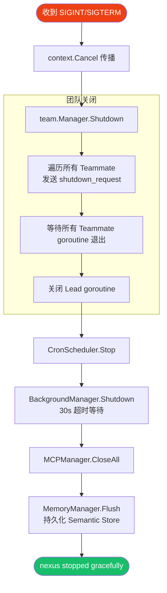

---

## 2. Gateway 网关模块

### 2.1 HTTP/WebSocket 请求路由

```mermaid
flowchart TD
    REQ([客户端请求]) --> TRACE_MW[Trace 中间件<br/>注入 X-Request-ID]

    TRACE_MW --> ROUTE{路由分发}
    ROUTE -->|GET /api/health| HEALTH[返回 status:ok]
    ROUTE -->|POST /api/sessions| CREATE_SESS[创建 Session<br/>BindingRouter 绑定默认 Agent]
    ROUTE -->|POST /api/chat| CHAT[Chat 处理]
    ROUTE -->|GET /api/ws| WS[WebSocket 升级]

    CHAT --> VALIDATE{校验 session_id + input}
    VALIDATE -->|缺失| ERR_400[400 Bad Request]
    VALIDATE -->|session 不存在| ERR_404[404 Not Found]
    VALIDATE -->|通过| TOUCH[SessionManager.Touch 续期]
    TOUCH --> SELECT_LANE[选择 Lane<br/>默认 main]
    SELECT_LANE --> SUBMIT[LaneManager.Submit]
    SUBMIT --> TEAM_CALL[team.Manager.HandleRequest<br/>→ Lead 处理]
    TEAM_CALL --> RESPOND[JSON Response {output}]

    WS --> WS_LOOP[WebSocket 消息循环]
    WS_LOOP --> WS_PARSE[解析 JSON {session_id, input}]
    WS_PARSE --> WS_VALIDATE{校验}
    WS_VALIDATE -->|通过| WS_SUBMIT[LaneManager.Submit]
    WS_SUBMIT --> WS_RESULT[按 2048 rune 分帧回写]

    style REQ fill:#2d8cf0,color:#fff
```

### 2.2 Lane 并发控制

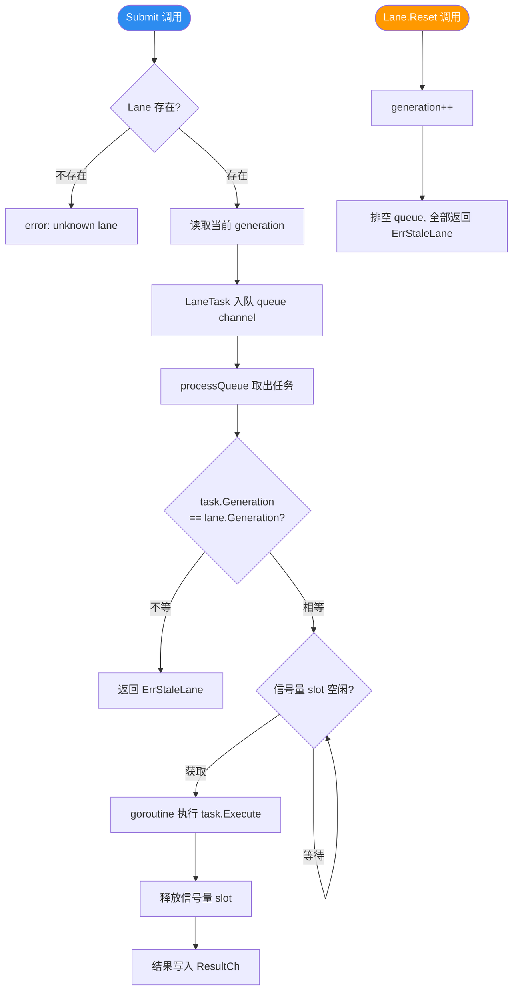

### 2.3 Session 与 BindingRouter

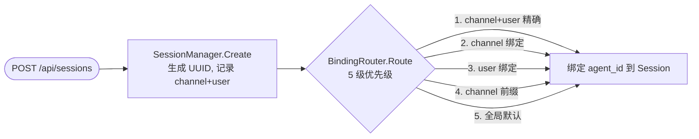

---

## 3. Team 团队协作调度模块

### 3.1 Lead 请求处理主流程

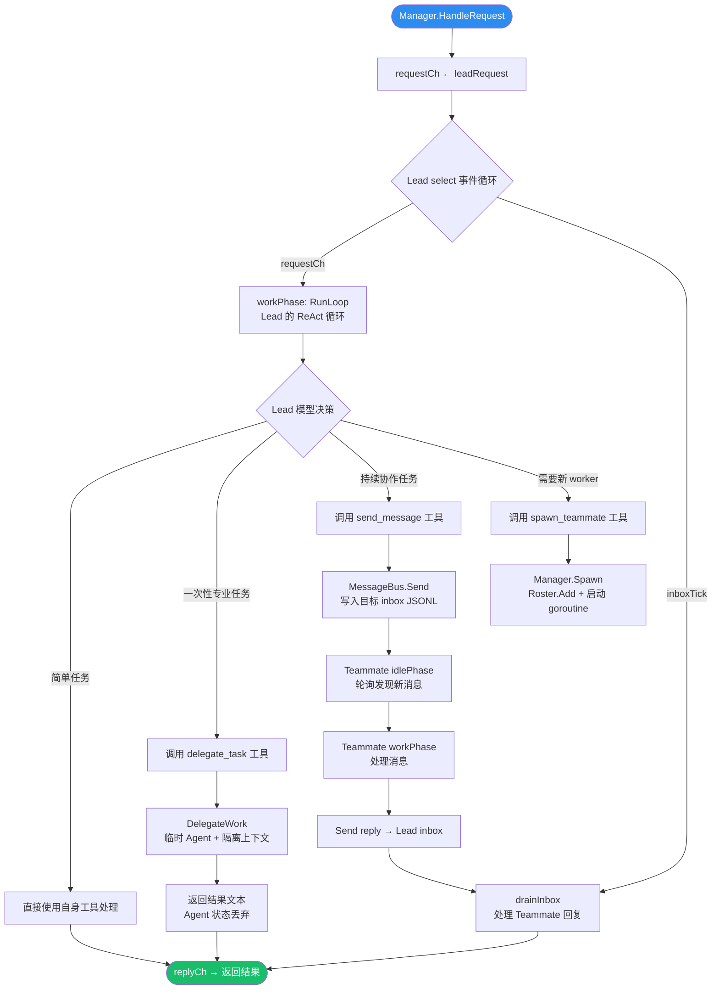

### 3.2 Teammate 生命周期状态机

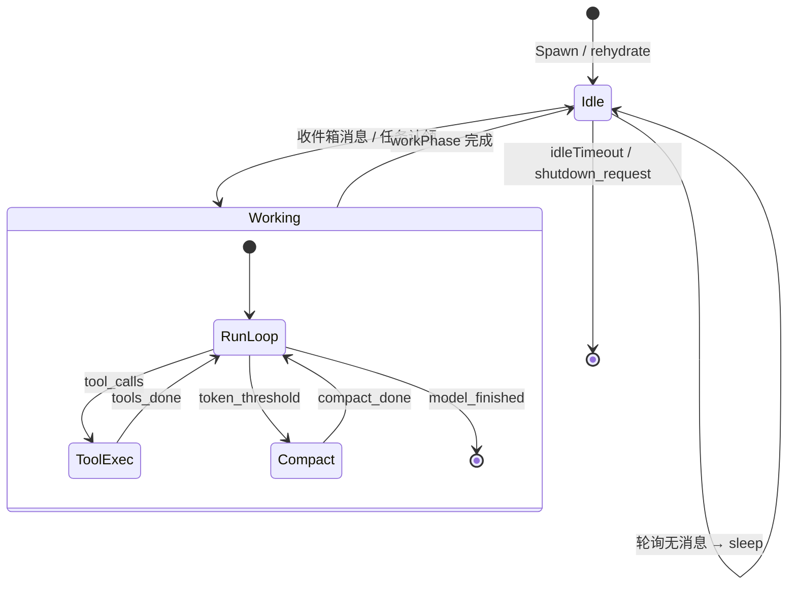

### 3.3 Teammate idle 阶段三级优先级

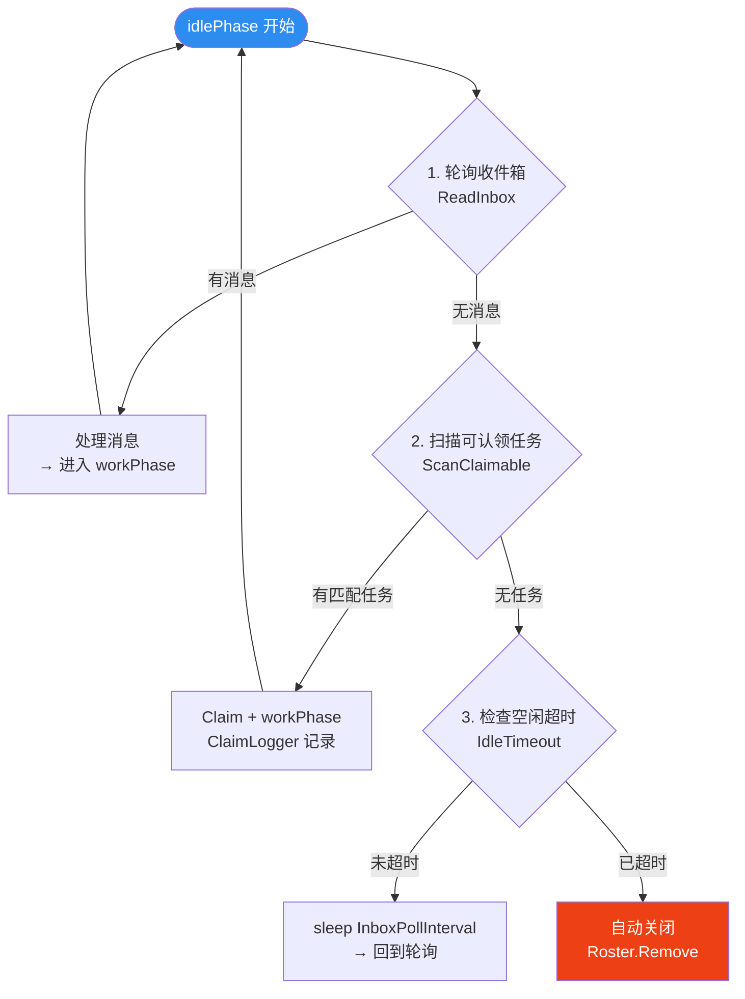

### 3.4 MessageBus 通信流程

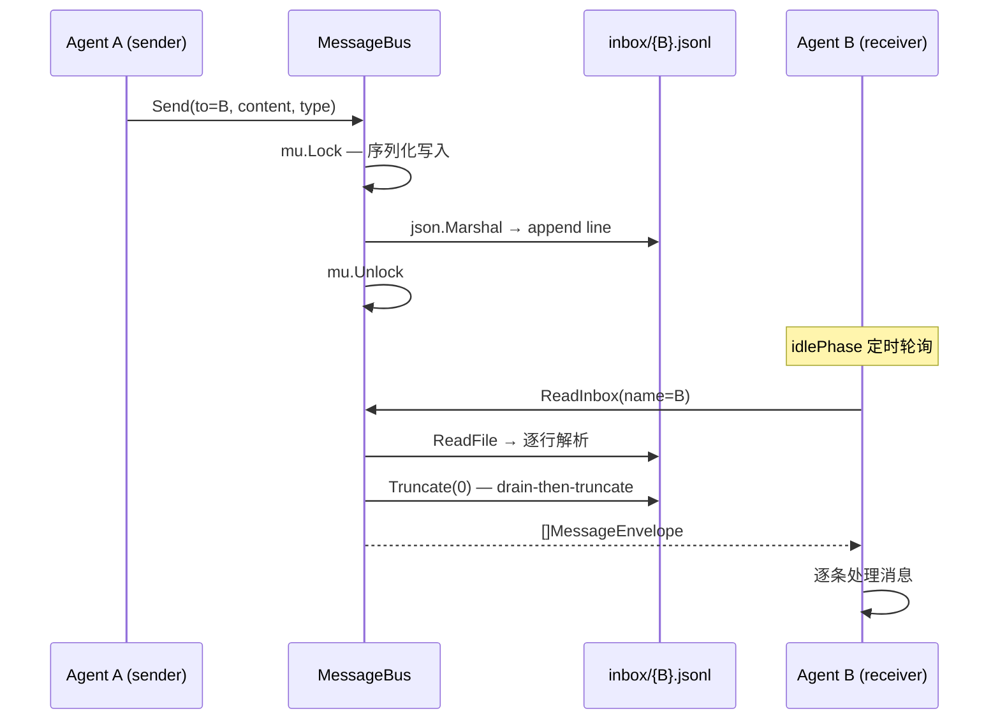

### 3.5 Delegate 一次性任务

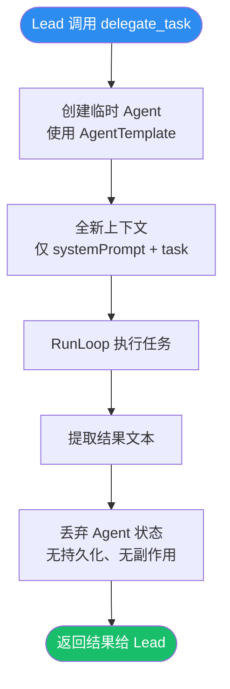

### 3.6 角色模板注册

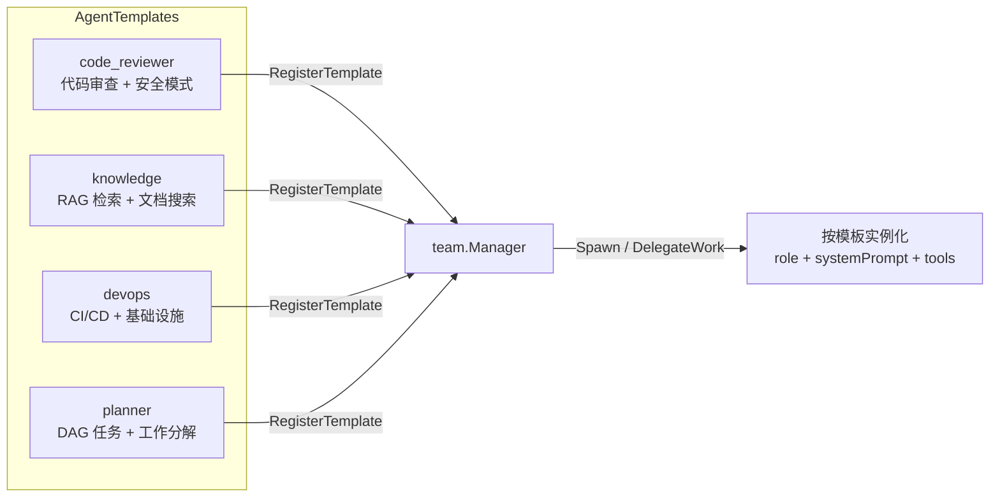

---

## 4. Core AgentLoop 核心循环

### 4.1 ReAct 循环状态机

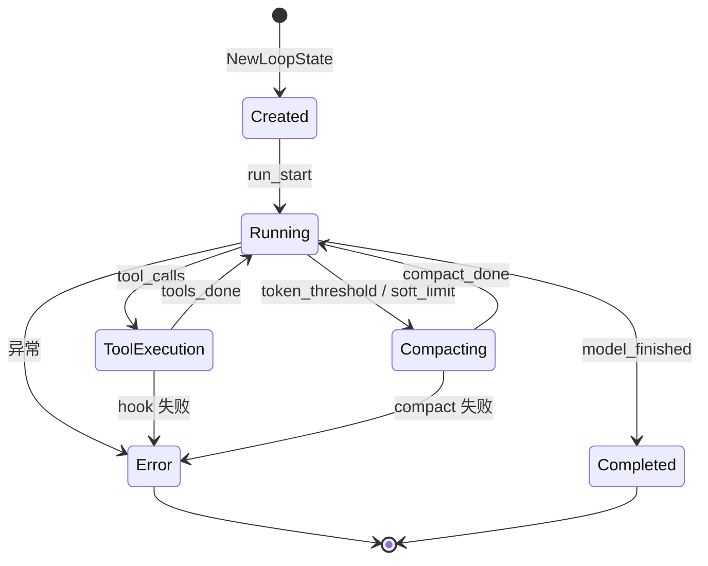

### 4.2 RunLoop 详细流程

```mermaid
flowchart TD
    START([RunLoop 入口]) --> NIL_CHECK{model != nil?}
    NIL_CHECK -->|否| FAIL_NIL[error: nil ChatModel]
    NIL_CHECK -->|是| INIT_STATE[NewLoopState → PhaseRunning]
    INIT_STATE --> USER_MSG[构造 UserMessage 追加到 state]

    USER_MSG --> ITER_START{iter < maxIter?}
    ITER_START -->|否| EXCEED_ERR[error: exceeded max_iterations]
    ITER_START -->|是| COMPACT[ContextGuard.MaybeCompact]

    COMPACT --> PRE_API{PreAPI Hook?}
    PRE_API -->|有| RUN_PRE_API[执行 PreAPI]
    PRE_API -->|无| GENERATE
    RUN_PRE_API --> GENERATE

    GENERATE[model.Generate<br/>system + messages + tools]

    GENERATE --> RETRY{RecoveryManager?}
    RETRY -->|有| CALL_RETRY[CallWithRetry 包裹]
    RETRY -->|无| DIRECT_CALL[直接调用]
    CALL_RETRY --> GEN_RESULT
    DIRECT_CALL --> GEN_RESULT

    GEN_RESULT{生成成功?}
    GEN_RESULT -->|否 + ContextOverflow| FORCE_COMPACT[ForceManualCompact → 重试]
    GEN_RESULT -->|否 其他| GEN_ERR[error: model generate]
    GEN_RESULT -->|是| POST_API

    POST_API{PostAPI Hook?}
    POST_API -->|有| RUN_POST_API[执行 PostAPI]
    POST_API -->|无| CONTINUE_CHECK
    RUN_POST_API --> CONTINUE_CHECK

    CONTINUE_CHECK{shouldContinueWithTools?}
    CONTINUE_CHECK -->|否: 纯文本| FINISH[追加 AssistantMessage<br/>PhaseCompleted → 返回]
    CONTINUE_CHECK -->|是: 有 ToolCalls| TOOL_PHASE[PhaseToolExecution]

    TOOL_PHASE --> TOOL_LOOP[遍历每个 ToolCall]

    subgraph 工具执行
        TOOL_LOOP --> PRE_TOOL[PreTool Hook]
        PRE_TOOL --> RESOLVE[resolveTool<br/>本地优先 → 全局 Registry]
        RESOLVE --> PERM[PermPipeline.CheckTool]
        PERM -->|拒绝| TOOL_ERR[WrapToolError]
        PERM -->|允许| EXEC_HANDLER[handler(ctx, args)]
        EXEC_HANDLER --> MICRO{输出 > MicroCompactSize?}
        MICRO -->|是| PERSIST[PersistLargeOutput → 替换为标记]
        MICRO -->|否| TOOL_RESULT[追加 ToolMessage]
        PERSIST --> TOOL_RESULT
        TOOL_ERR --> TOOL_RESULT
        TOOL_RESULT --> POST_TOOL[PostTool Hook]
        POST_TOOL --> NEXT_TOOL{还有下一个 ToolCall?}
        NEXT_TOOL -->|是| TOOL_LOOP
        NEXT_TOOL -->|否| BACK_RUN[PhaseRunning → tools_done]
    end

    BACK_RUN --> ITER_START
    FORCE_COMPACT --> GENERATE

    style START fill:#2d8cf0,color:#fff
    style FINISH fill:#19be6b,color:#fff
    style GEN_ERR fill:#ed4014,color:#fff
    style EXCEED_ERR fill:#ed4014,color:#fff
```

### 4.3 ContextGuard 上下文压缩

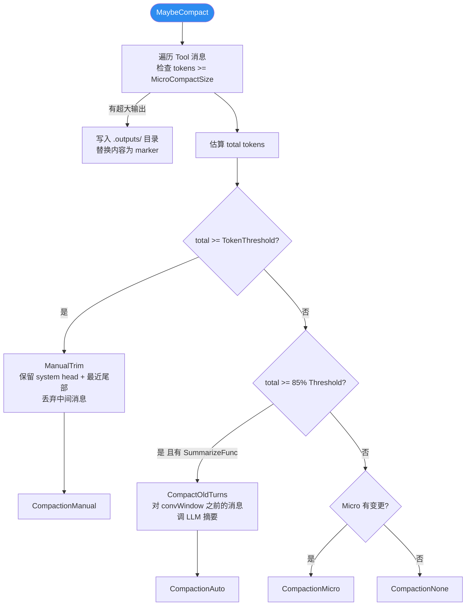

---

## 5. Tool 工具系统

### 5.1 Registry 注册与查找

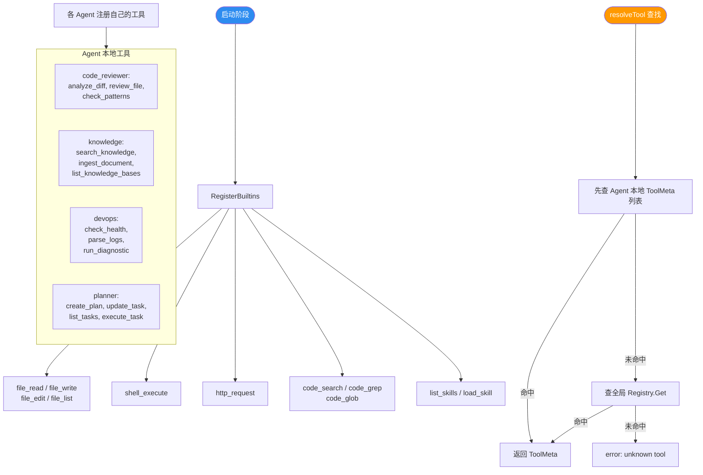

### 5.2 MCP 协议交互

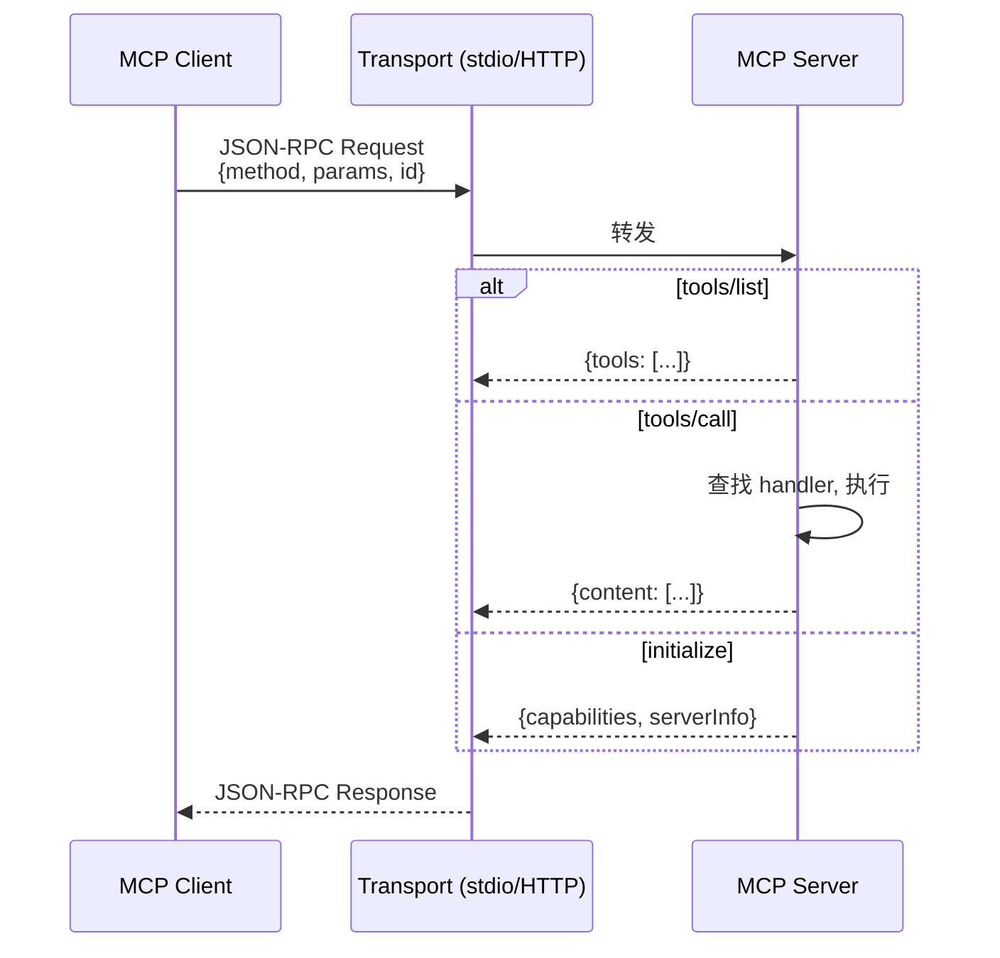

---

## 6. Permission 权限管线

### 6.1 五阶段检查流程

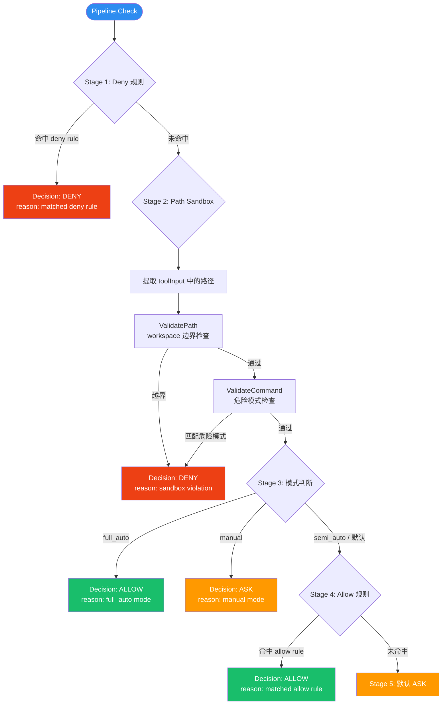

---

## 7. RAG 检索增强生成

### 7.1 Ingest 索引管线

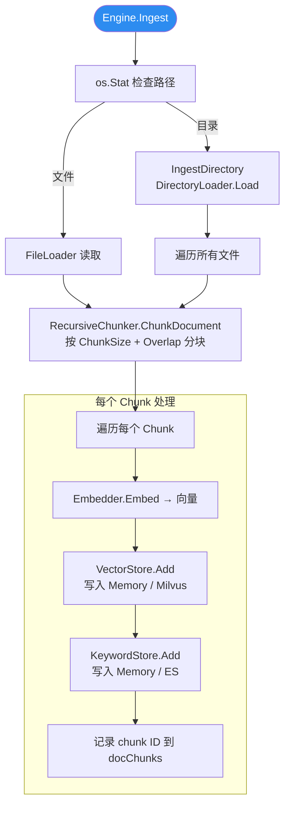

### 7.2 Query 检索管线

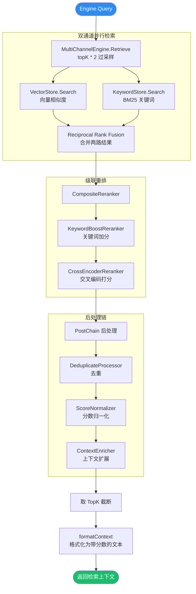

---

## 8. Memory 记忆系统

### 8.1 双层记忆架构

```mermaid
flowchart TD
    MANAGER([Memory Manager]) --> CONV[ConversationMemory<br/>滑动窗口缓冲]
    MANAGER --> SEM[SemanticStore<br/>YAML 持久化]

    CONV --> WINDOW[保留最近 N 条消息]
    CONV --> SUMMARIES[对超出窗口的历史生成摘要]

    SEM --> YAML_FILE[.memory/semantic.yaml]
    SEM --> SEARCH[相关性搜索]
    SEM --> CRUD[增/删/改]

    BUILD([BuildPromptSection]) --> READ_SUM[读取 Summaries]
    BUILD --> READ_SEM[读取 Semantic Section]
    READ_SUM --> JOIN[拼接 Earlier conversation 段]
    READ_SEM --> JOIN
    JOIN --> PROMPT_SECTION[注入 System Prompt]
```

### 8.2 Compaction 压缩策略

```mermaid
flowchart LR
    subgraph 三级压缩
        MICRO[Micro 压缩<br/>大输出落盘<br/>成本: I/O]
        AUTO[Auto 压缩<br/>LLM 摘要旧轮次<br/>成本: LLM 调用]
        MANUAL[Manual 压缩<br/>丢弃中间消息<br/>成本: 信息丢失]
    end

    MICRO -->|85% 阈值| AUTO
    AUTO -->|100% 阈值| MANUAL
```

---

## 9. Intelligence 智能组装

### 9.1 Prompt 组装流程

```mermaid
flowchart TD
    BUILD([PromptAssembler.Build]) --> BOOTSTRAP[BootstrapLoader.Load<br/>读取 workspace/ 下的 MD 文件]

    subgraph Bootstrap 文件
        SOUL[SOUL.md — 核心理念]
        IDENTITY[IDENTITY.md — 身份定义]
        TOOLS_DOC[TOOLS.md — 工具文档]
        MEMORY_DOC[MEMORY.md — 记忆指南]
    end

    BOOTSTRAP --> CAP_BS[截断到 BootstrapMax<br/>默认 150K chars]

    BUILD --> SKILL_SCAN[SkillManager.ScanSkills<br/>扫描 workspace/skills/*/SKILL.md]
    SKILL_SCAN --> SKILL_INDEX[GetIndexPrompt<br/>生成技能索引摘要]
    SKILL_INDEX --> CAP_SK[截断到 SkillIndexMax<br/>默认 30K chars]

    BUILD --> MEM_SEC[传入 memorySection]
    MEM_SEC --> CAP_MEM[截断到 MemoryMax<br/>默认 20K chars]

    CAP_BS --> ASSEMBLE[拼接三段]
    CAP_SK --> ASSEMBLE
    CAP_MEM --> ASSEMBLE
    ASSEMBLE --> CAP_TOTAL[总体截断到 TotalMax<br/>默认 200K chars]
    CAP_TOTAL --> RESULT([最终 System Prompt])

    style BUILD fill:#2d8cf0,color:#fff
    style RESULT fill:#19be6b,color:#fff
```

### 9.2 Skill 技能加载

```mermaid
flowchart TD
    SCAN([ScanSkills]) --> WALK[遍历 skills/ 子目录]
    WALK --> READ_FM[读取 SKILL.md YAML frontmatter<br/>name, description, invocation]
    READ_FM --> INDEX[建立技能索引 in-memory]

    LIST([list_skills 工具]) --> RETURN_INDEX[返回所有技能名 + 描述]

    LOAD([load_skill 工具]) --> FIND[按 name 查找]
    FIND --> READ_BODY[按需加载完整 SKILL.md body]
    READ_BODY --> INJECT[注入 ToolResult → 回到 AgentLoop]
```

---

## 10. Planning 规划与调度

### 10.1 Task DAG 管理

```mermaid
flowchart TD
    CREATE([create_plan 工具]) --> PARSE_TASKS[解析任务列表 + 依赖关系]
    PARSE_TASKS --> CYCLE_CHECK[DAG 环检测]
    CYCLE_CHECK -->|有环| REJECT[拒绝创建]
    CYCLE_CHECK -->|无环| PERSIST[写入 task_<id>.json + meta.json]

    UPDATE([update_task 工具]) --> GET_TASK[TaskManager.Get]
    GET_TASK --> STATUS_TRANS{状态转换合法?}
    STATUS_TRANS -->|是| WRITE_STATUS[更新状态并持久化]
    STATUS_TRANS -->|否| TRANS_ERR[error: invalid transition]

    subgraph 任务状态流转
        PENDING[Pending] -->|Claim| IN_PROGRESS[InProgress]
        IN_PROGRESS -->|Complete| COMPLETED[Completed]
        IN_PROGRESS -->|Fail| PENDING
        PENDING -->|Block| BLOCKED[Blocked]
        BLOCKED -->|Unblock| PENDING
        PENDING -->|Cancel| CANCELLED[Cancelled]
    end
```

### 10.2 PlanExecutor 执行器

```mermaid
flowchart TD
    EXEC_NEXT([ExecuteNext]) --> GET_UNCLAIMED[TaskManager.GetUnclaimed<br/>获取首个未认领任务]
    GET_UNCLAIMED -->|无任务| NO_WORK[error: no unclaimed tasks]
    GET_UNCLAIMED -->|有| EXEC_TASK

    EXEC_TASK([ExecuteTask]) --> GET[TaskManager.Get]
    GET --> RESOLVE_AGENT[agentResolver(task.Title)<br/>决定由哪个 Agent 执行]
    RESOLVE_AGENT --> CLAIM[TaskManager.Claim<br/>标记为 InProgress]

    CLAIM --> SUBMIT_BG[BackgroundManager.Submit]

    subgraph BackgroundManager
        SUBMIT_BG --> SLOT{有空闲 slot?}
        SLOT -->|否| WAIT[等待 slot]
        SLOT -->|是| GOROUTINE[启动 goroutine]
        GOROUTINE --> RUNNER[runner(ctx, agent, task)]
        RUNNER -->|成功| MARK_DONE[TaskManager.Update → Completed]
        RUNNER -->|失败| MARK_RETRY[TaskManager.Update → Pending]
    end

    style EXEC_NEXT fill:#2d8cf0,color:#fff
```

### 10.3 CronScheduler 定时调度

```mermaid
flowchart TD
    START([CronScheduler.Start]) --> LOAD_JOBS[加载 cron_jobs.json]
    LOAD_JOBS --> REG_CRON[注册到 robfig/cron]
    REG_CRON --> TICK[Cron 引擎定时触发]

    TICK --> HANDLER{handler 配置?}
    HANDLER -->|nil| NOOP[无操作日志]
    HANDLER -->|有| CALLBACK[调用 handler(job)]

    STOP([CronScheduler.Stop]) --> CRON_STOP[cron.Stop 停止调度]
```

---

## 11. Reflection 反思引擎

### 11.1 三阶段反思循环

```mermaid
flowchart TD
    RUN([RunWithReflection]) --> P1{Phase 1: 前瞻反思<br/>enableProspect?}

    P1 -->|是| SEARCH_MEM[ReflectionMemory.SearchRelevant<br/>查找相关历史教训]
    SEARCH_MEM --> CRITIQUE[Prospector.Critique<br/>预判风险]
    CRITIQUE --> ENRICH_INPUT[enrichInput<br/>注入 [Prospective guidance]<br/>+ [Lessons from past attempts]]
    ENRICH_INPUT --> P2

    P1 -->|否| P2

    P2[Phase 2: 执行 + 评估] --> AGENT_RUN[Agent.Run<br/>执行实际任务]
    AGENT_RUN --> EVALUATE[Evaluator.Evaluate<br/>打分 + 判断 Pass/Fail]

    EVALUATE --> PASS{评估通过?}

    PASS -->|是 且 attempt > 0| STORE_SUCCESS[存储 Macro 成功经验]
    PASS -->|是| RETURN_OUTPUT([返回输出])
    STORE_SUCCESS --> RETURN_OUTPUT

    PASS -->|否| P3[Phase 3: 回顾反思]
    P3 --> REFLECT[Reflector.Reflect<br/>分析失败模式]
    REFLECT --> STORE_REF[ReflectionMemory.Store<br/>持久化反思]
    STORE_REF --> ENRICH_REF[enrichWithReflection<br/>注入 [Self-reflection] 到下轮输入]
    ENRICH_REF --> ATTEMPT_CHECK{attempt < maxAttempts?}
    ATTEMPT_CHECK -->|是| P2
    ATTEMPT_CHECK -->|否| EXHAUST([返回最后一次输出<br/>warn: exhausted])

    style RUN fill:#2d8cf0,color:#fff
    style RETURN_OUTPUT fill:#19be6b,color:#fff
    style EXHAUST fill:#ff9900,color:#fff
```

### 11.2 反思记忆层级

```mermaid
graph TD
    subgraph Micro 微观
        M1[单步工具调用错误]
        M2[参数格式纠正]
    end
    subgraph Meso 中观
        M3[任务级策略偏差]
        M4[多步执行路径优化]
    end
    subgraph Macro 宏观
        M5[跨任务模式识别]
        M6[长期能力改进]
    end

    M1 --> M3
    M2 --> M3
    M3 --> M5
    M4 --> M6
```

---

## 12. Observability 可观测性

### 12.1 三支柱架构

```mermaid
flowchart LR
    OBS([observability.New]) --> LOG[日志 Logger<br/>Info / Warn / Error]
    OBS --> TRACE[Tracer<br/>内存 Span 追踪]
    OBS --> METRICS[MetricsCollector<br/>计数器 + 直方图]

    subgraph CallbackHandler
        CB_LLM_START[OnLLMStart]
        CB_LLM_END[OnLLMEnd]
        CB_TOOL_START[OnToolStart]
        CB_TOOL_END[OnToolEnd]
    end

    CB_LLM_START --> LOG
    CB_LLM_START --> TRACE
    CB_LLM_START --> METRICS
    CB_LLM_END --> LOG
    CB_TOOL_END --> METRICS
```

### 12.2 AgentLoop Hook 集成

```mermaid
sequenceDiagram
    participant Loop as AgentLoop
    participant Hooks as LoopHooks
    participant OBS as Observability

    Loop->>Hooks: PreAPI(state, iter)
    Hooks->>OBS: Tracer.StartSpan("llm_call")
    Loop->>Loop: model.Generate(...)
    Loop->>Hooks: PostAPI(state, resp, iter)
    Hooks->>OBS: Tracer.EndSpan + Metrics.RecordLatency

    Loop->>Hooks: PreTool(state, toolCall)
    Hooks->>OBS: Tracer.StartSpan("tool_exec")
    Loop->>Loop: handler(ctx, args)
    Loop->>Hooks: PostTool(state, result, err)
    Hooks->>OBS: Tracer.EndSpan + Metrics.IncCounter
```

---

## 13. 模块间依赖总览

```mermaid
graph TD
    MAIN[cmd/nexus/main] --> GW[gateway]
    MAIN --> TEAM[team]
    MAIN --> AGENTS[agents/*]
    MAIN --> CORE[core]
    MAIN --> TOOL_PKG[tool]
    MAIN --> MCP_PKG[tool/mcp]
    MAIN --> MEM[memory]
    MAIN --> RAG_PKG[rag]
    MAIN --> PLAN[planning]
    MAIN --> INTEL[intelligence]
    MAIN --> PERM[permission]
    MAIN --> OBS_PKG[observability]

    GW -->|Supervisor 接口| TEAM
    TEAM -->|Lead/Teammate/Delegate| CORE
    TEAM -->|AgentTemplate| AGENTS
    TEAM -->|ScanClaimable| PLAN
    TEAM -->|MessageBus + Roster| TEAM_FS[.team/ 目录]

    AGENTS --> CORE
    AGENTS -->|knowledge| RAG_PKG
    AGENTS -->|planner| PLAN

    CORE --> TYPES[pkg/types]
    CORE --> UTILS[pkg/utils]
    CORE -->|PermPipeline 接口| PERM
    CORE -->|ToolRegistry 接口| TOOL_PKG

    INTEL --> SKILL_FILES[workspace/skills/]

    TOOL_PKG --> BUILTIN[tool/builtin]
    BUILTIN --> INTEL

    style MAIN fill:#2d8cf0,color:#fff
    style TEAM fill:#7b68ee,color:#fff
    style CORE fill:#515a6e,color:#fff
    style TYPES fill:#515a6e,color:#fff
```

### 数据流向总结

| 方向 | 路径 | 数据 |
|------|------|------|
| 请求入口 | Client → Gateway → Lane → team.Manager → Lead | 用户输入 |
| Lead 直接处理 | Lead → AgentLoop → ChatModel ↔ Tool(Registry + Permission) | ReAct 循环 |
| 委派任务 | Lead → delegate_task → 临时 Agent（隔离上下文）→ 结果返回 | 一次性结果 |
| 异步协作 | Lead → MessageBus → Teammate inbox → workPhase → reply → Lead inbox | JSONL 消息 |
| 自治调度 | Teammate idlePhase → ScanClaimable → Claim → workPhase | DAG 任务认领 |
| 知识检索 | Agent tool → RAG Engine → VectorStore + KeywordStore → Reranker | 检索上下文 |
| 记忆注入 | Memory Manager → PromptAssembler → System Prompt | 历史摘要 + 语义记忆 |
| 技能加载 | SkillManager → PromptAssembler / load_skill tool | 技能文本 |
| 任务调度 | Planner Agent → TaskManager → PlanExecutor → BackgroundManager | DAG 任务 |
| 反思改进 | Reflection Engine → Prospector / Evaluator / Reflector → Memory | 经验教训 |
| 可观测 | LoopHooks → CallbackHandler → Logger + Tracer + Metrics | 日志/指标/链路 |
